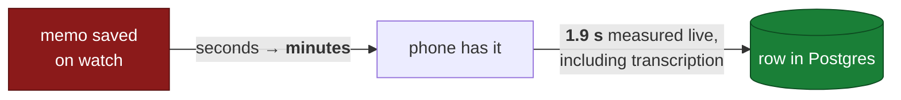
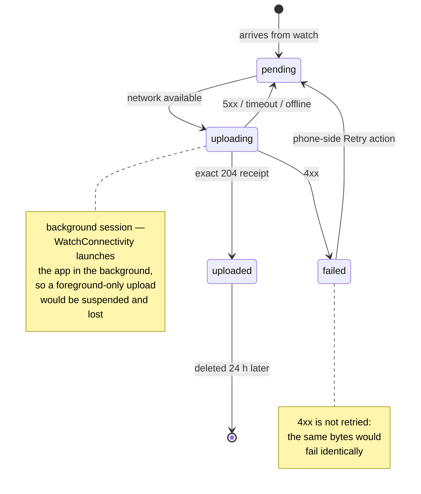
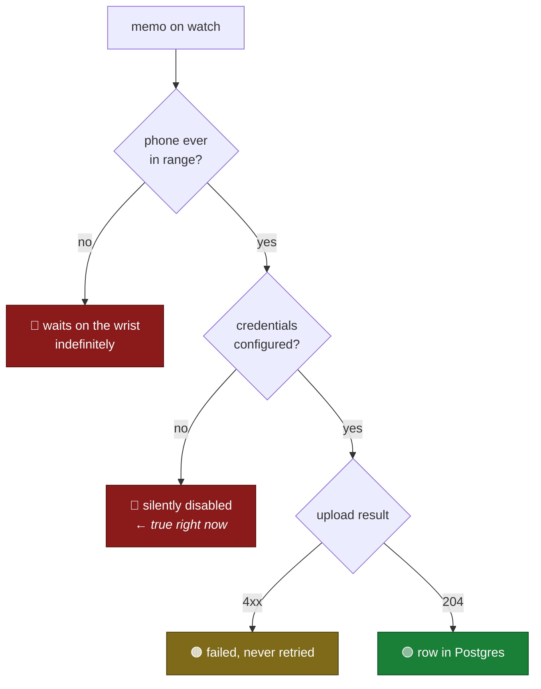

# The upload path

**Date:** 2026-08-06
**Decided:** the watch transfers to the phone, and **the phone does the upload**.
The watch never talks to the cloud.

Detail of [1_INGEST_ARCHITECTURE.md](1_INGEST_ARCHITECTURE.md). The Cloud Run
service is live; this is only about how bytes reach it.

---

## The path

```mermaid
flowchart LR
    subgraph W["⌚️ Watch"]
        direction TB
        REC["record<br/>PCM → AAC 32 kbit/s"]
        WD[("Application Support/<br/>Memos/id.m4a")]
        REC --> WD
    end

    subgraph P["📱 Phone"]
        direction TB
        RX["session(_:didReceive:)"]
        PD[("Documents/Memos/<br/>id.m4a + id.json")]
        UP["background URLSession"]
        RX --> PD --> UP
    end

    subgraph G["☁️ GCP"]
        direction TB
        CR["Cloud Run<br/>wristmemo-ingest"]
        DB[("Cloud SQL<br/>wristmemo.memos")]
        CR --> DB
    end

    WD ==>|"① transferFile<br/>audio + id, createdAt, duration"| RX
    UP ==>|"② POST /v1/memos/{id}<br/>raw audio + Bearer token"| CR
    CR -.->|"③ 204, no body"| UP

    style WD fill:#1a5c7f,stroke:#0d3a52,color:#fff
    style PD fill:#1a5c7f,stroke:#0d3a52,color:#fff
    style DB fill:#1a7f37,stroke:#0d4a20,color:#fff
```



**Blue is audio at rest. Green is text at rest.** Audio lives on the two Apple
devices and nowhere else — Cloud Run streams it through to OpenAI and never
writes it. Green is the only copy that is permanent: each device deletes its
audio 24 h after the next hop has taken it (see `Retention` and DESIGN.md
§"Memos delete themselves"). Nothing that has not moved on is ever deleted, so
the deletion clock only ever starts behind a copy that already exists.

---

## What each leg guarantees

| | Leg ① watch → phone | Leg ② phone → Cloud Run |
|---|---|---|
| Primitive | `WCSession.transferFile` | background `URLSession` |
| Durable across app death | yes, OS-queued | yes, system daemon |
| Timing | **system-scheduled — minutes** | ~2 s once it starts |
| Retry | `sendPending()` on activation + reachability | backoff 30 s → 30 min |
| Deletes the source | **never** — the sender's copy is deleted later, by the retention sweep, and only once this leg has succeeded | **never** |

Both legs are best-effort on top of a memo that is *already safe on disk*. The
recording is committed before either is attempted, so no failure anywhere in
this diagram can lose a memo.

### The timing is all in leg ①



`transferFile` is queued and persistent but delivers when the system feels like
it. **Do not optimise leg ②** — it is already ~1.9 s against a hop that takes
minutes.

`sendMessageData` would be immediate but is meant for small payloads, and a memo
is ~240 KB per minute. `transferFile` is the only viable primitive for audio.

---

## The memo's upload state

Persisted in the phone's sidecar (`Documents/Memos/<id>.json`), so an upload
interrupted by the app being killed is picked up on the next launch.



On relaunch, `recoverBackgroundTasks()` reconciles anything persisted as
`uploading` against the tasks `URLSession` still owns, and requeues only the
ones with no task left to finish them. Re-sending is free — the server is
idempotent on the memo's UUID.

---

## Where a memo can get stuck



**Nothing is ever lost** — every one of these states is one the retention sweep
refuses to delete, so a stuck memo keeps its audio for as long as it is stuck.
But all three failure paths are *invisible*, because stage 1 is a one-way door
with no upload UI.

On real hardware the app is still sitting in the second red box —
`IngestCredentials.current` is `nil` until the scheme supplies it, so uploads
are disabled with one log line and no memo is ever sent. `./cloud.sh` supplies
credentials itself, which is why the simulator path is green while the device
path has never run.

---

## Testing leg ② without a watch

`./cloud.sh --db` runs the whole upload leg against the real service:

```
✓ service reachable
✓ simulator ready
✓ planted memo 07ac054b-…
✓ app reports uploaded
✓ row in Cloud SQL: investment idea | increase the position in Broadcom…
green
```

It plants a memo directly into the phone app's container exactly as
`session(_:didReceive:)` would have left it, so **no watch, no pair and no
WatchConnectivity are involved**. Credentials reach the app through
`SIMCTL_CHILD_*`, which means no token is ever written into the Xcode scheme —
that file is committed.

**What it does not prove:** the simulator has no background transfer daemon, so
`TranscriptionClient` falls back to a default `URLSession` there. The request,
auth, retry policy and state machine are all exercised; that an upload *survives
the app being suspended* can only be shown on hardware.

## What is left

1. **Run it on hardware.** Set `WRISTMEMO_INGEST_URL` and
   `WRISTMEMO_INGEST_TOKEN` in the Xcode scheme's environment for one launch;
   `IngestCredentials` persists them to the Keychain so later on-device launches
   work without Xcode. Then record a memo on the watch and confirm the row.
   This is the only remaining untested thing: leg ① from real hardware, and the
   background session doing what the simulator cannot.

---

## Why not have the watch upload directly

It is possible — watchOS has full `URLSession` and the watch has WiFi, LTE on
cellular models. It was rejected because `transferFile` is free and already
durable, the watch would need the token, and radio use on the wrist is the most
expensive thing in this design. The one case it wins is a phone left at home,
which is the first red box above.

If that becomes worth fixing, it is **additive, not a rewrite**: the server
dedups on the watch-generated UUID, so the watch could upload opportunistically
with the phone still acting as backstop, and the overlap costs nothing.
