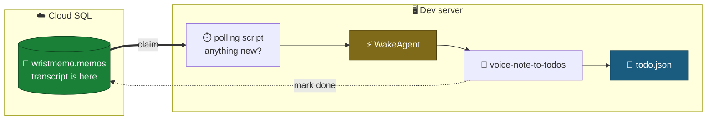
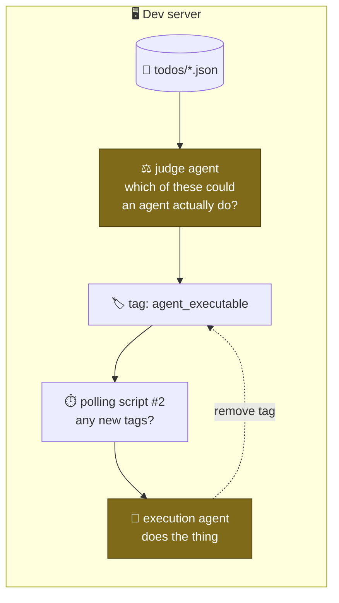

#  Architecture 2 — transcript to todos

**Date:** 2026-08-06
**Status:** proposal. Nothing built.
Stage 1 ([1_INGEST_ARCHITECTURE.md](1_INGEST_ARCHITECTURE.md)) is live and ends
where this begins.

**Starting point: the transcript is already a row in Postgres.**

---

## The flow



The database is the only thing outside the dev server. Everything else — the
polling script, WakeAgent, the agent, and the file it writes — is one machine,
and the only traffic across the boundary is a claim and a completion.

`WakeAgent` is amber because **it does not exist** — there is no such command
anywhere on this machine. It has to be built.

---

## todo.json

```json
{
  "todos": [
    {
      "memo_id": "6e7316ea-117c-494c-8dfa-4e9265f7a644",
      "text": "Buy more NVDA before earnings",
      "route": "investment idea",
      "recorded_at": "2026-08-06T18:06:40Z"
    }
  ]
}
```

The agent writes `todos/<memo_id>.json`; a merge produces `todo.json`. Two
agents appending to one file would silently lose each other's writes, and
keying on `memo_id` means re-running a memo replaces rather than duplicates.

---

## Strawman: agent execution

What happens to a todo once it exists. Explicitly a strawman — the shape is
right, the mechanics below have holes.


