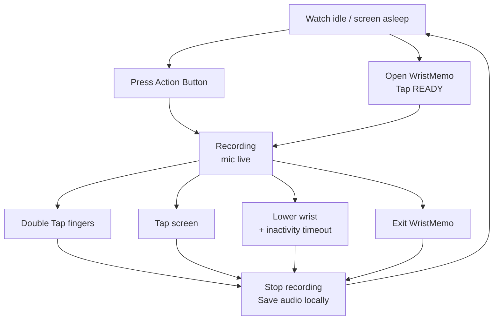

# WristMemo — agent guidance

## Product north star

WristMemo exists to be the **lowest-friction way to capture a thought with
enough context to make it useful later**.

The ideal interaction is: a thought occurs → one intentional physical action →
start cue → speak naturally → stop → the thought is safe, findable, and usable.
The user should not need to unlock a phone, choose a destination, type a title,
categorise a note, or wait for a model before speaking.

The current Apple Watch implementation is the first capture surface, not the
product boundary. Investment research is an important initial use case, but do
not narrow general capture mechanics around investment-specific assumptions.

## Product decision test

Before proposing or implementing a feature, ask:

1. Does it reduce time, attention, or hand/eye movement between having a
   thought and safely capturing it?
2. Does it preserve or add useful context without asking the speaker to do
   extra work at capture time?
3. Does it make captured thoughts more trustworthy, retrievable, or reviewable
   later?

If the answer to none is yes, it is probably scope creep. Prefer invisible,
reliable infrastructure and later processing over another capture-time control
or screen.

## Non-negotiable capture properties

- **Capture first.** Never put networking, transcription, database work, or
  non-essential UI on the recording hot path.
- **Do not lose the opening.** Measure press-to-first-sample latency on real
  hardware; the recording haptic is a start cue and must mean the microphone
  is live.
- **One gesture, no decisions.** Routing and organisation should be inferred
  after capture or spoken naturally as part of the note. Never require a picker
  before recording.
- **Audio is the ground truth.** Preserve it locally until a verified hand-off;
  transcripts and agent output are derived, fallible artifacts.
- **Failures must become visible.** A stalled or failed thought is worse than a
  visible error. Keep end-to-end status, retry paths, and reconciliation ahead
  of feature work.
- **Privacy is a feature.** No ambient or retroactive audio capture by default.
  Audio must not rest in GCP, logs, or a temporary server file.
- **Humans approve actions.** Downstream automation may draft, tag, or route;
  it must not perform consequential external actions based only on a transcript.

## The watch is a capture appliance

[`docs/product/CAPTURE_APPLIANCE.md`](docs/product/CAPTURE_APPLIANCE.md) is the
detailed product boundary. This section is its working summary.

Keep the watch app radically thin. Its job is limited to what must happen before
the audio can leave the wrist:

- receive an intentional start signal;
- pre-warm, open, and monitor the microphone;
- end safely with the least attention possible;
- commit a recoverable local audio file; and
- hand it to the phone while making a genuine delivery problem visible.

Everything else belongs on the phone, server, or later review surface:
transcription, entity extraction, routing, titles, summaries, context linking,
search, configuration, history, workflows, and agent drafts. The app should not
become a tiny memo manager merely because it can render those things.

### Capture interaction contract

Keep start and stop triggers explicit and one-directional. The only ways to
start a memo are the assigned Action Button control and a tap on the in-app
**READY** surface. The Action Button is launch-or-start: when idle, it opens
WristMemo and starts; when already starting, recording, or paused, it does
nothing. Double Tap must never start a memo.

Once recording, the intentional stop routes are Double Tap, a tap on the full
screen, lowering the wrist for the short inactivity timeout, and exiting the
app. Silence and safety caps remain automatic backstops, not extra controls.
There are exactly two haptic meanings: `.start` only when the microphone is
writing, and `.stop` whenever a recording ends. Never add acknowledgement,
warning, save, or failure haptics.

### Button-deletion test

For every watch control, ask: *if this disappeared, would a real thought become
harder to capture safely?* If not, remove it or move it downstream.

- Start belongs on the Action button / control or the single in-app READY
  surface, not behind a sequence of in-app choices.
- Stopping needs one deterministic fallback surface because every automatic or
  gesture path can fail. Double Tap, the full-screen stop target, wrist-down
  inactivity, app exit, and silence should remove the need to use it most of the
  time.
- A visible **Discard** control has a very high bar: it can destroy the only
  source recording. Prefer automatic handling of genuinely empty captures and
  keep any deletion reversible.
- Settings such as route, transcription behaviour, and silence preferences are
  not normal watch-screen content. Ship a safe default; put exceptional
  configuration on the phone or server.
- Lists, playback, editing, and transcript display do not belong on the watch's
  capture path.

## Engineering priorities

Prioritise work in this order:

1. Real-device capture reliability and latency.
2. Durable watch → phone → ingest delivery, with repairable failures.
3. A useful review/retrieval loop that resurfaces thoughts in context.
4. Richer extraction, routing, and domain-specific intelligence.
5. New integrations, agent execution, and optional capture modalities.

Treat the failure catalogue in
[`docs/operations/FAILURE_MODES.md`](docs/operations/FAILURE_MODES.md) as a
product backlog, not just documentation. Changes to the pipeline should add or
update tests for the failure mode they address.

## Working in this repository

- Read `README.md`, `docs/product/DESIGN.md`, the friction budget
  (`docs/operations/LATENCY.md`), `docs/operations/LIMITATIONS.md`, and
  `docs/operations/FAILURE_MODES.md` before changing capture or delivery
  behaviour.
- Preserve the deliberate architecture: watch records; phone transports audio;
  Cloud Run transcribes without persisting audio; Postgres stores text.
- Use UUIDs generated on the watch as the identity at every hop. Never mint a
  replacement identity for a recoverable transfer.
- Prefer status acknowledgements and reconciliation over sending transcript
  content back to the devices; the one-way content boundary is intentional.
- Do not silently delete audio merely to manage storage. Retention must happen
  only after the next durable hop is confirmed, with a recovery path.
- Run the narrowest relevant test first. `./sim.sh --unit` is the normal inner
  loop; use the full harness for capture, sync, and UI changes.

## Ideas that need a high bar

Avoid building these without evidence from real-device use that they solve a
core capture failure:

- More capture-time UI, menus, classifiers, or configuration.
- Continuous/retroactive recording, which carries privacy and consent risk.
- Realtime transcription or model output while the user is speaking.
- Autonomous execution agents.
- Integrations that turn the app into a generic note-taking hub.

The cleanest version of WristMemo should feel like a reflex: **think, press,
speak, trust it.**
