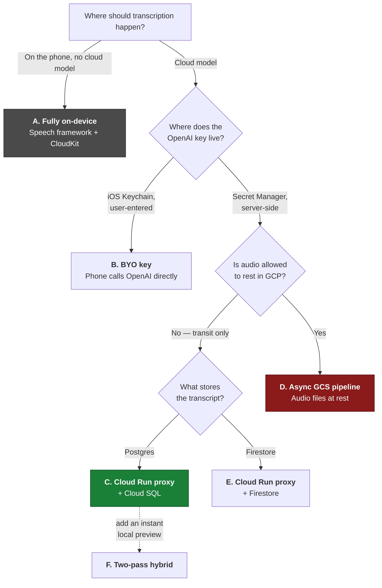
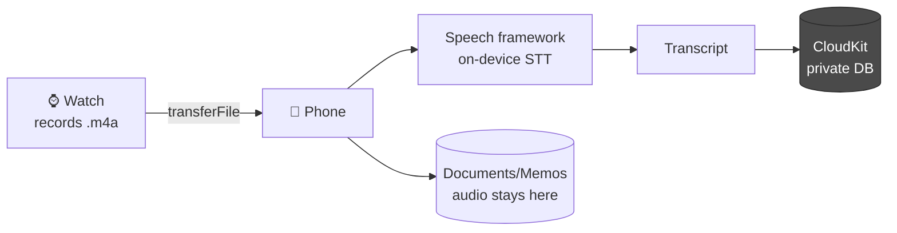
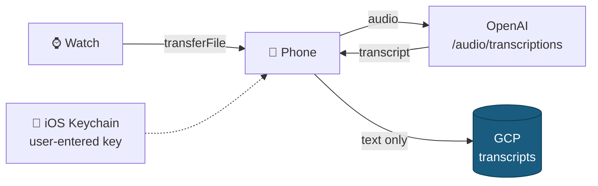
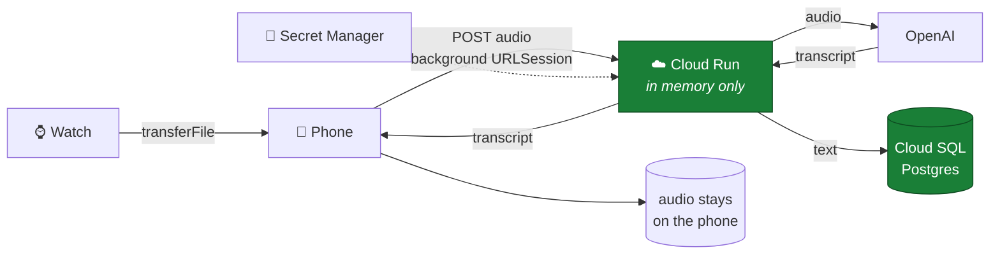
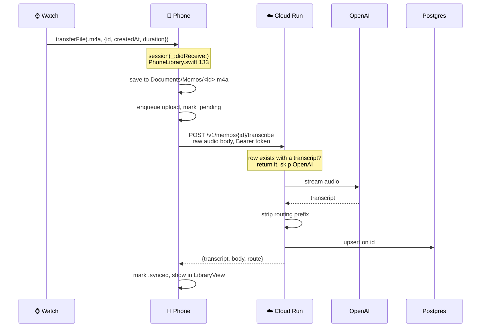
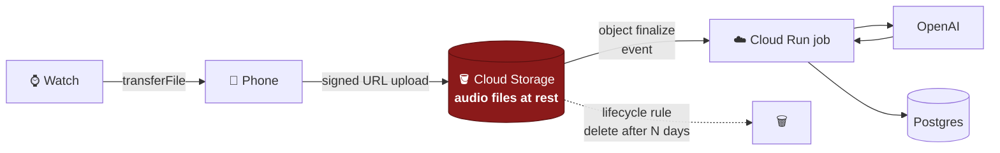
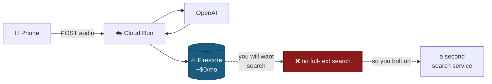
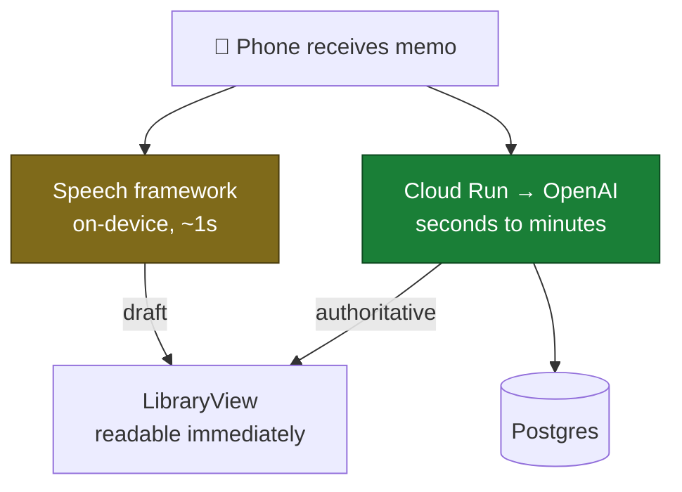

# Backend approaches

**Date:** 2026-08-06
Diagram companion to [BACKEND.md](BACKEND.md), which argues the case in prose.
This file is the same material as pictures, so the options can be compared at a
glance.

Six approaches. One is recommended, one is the honest baseline, one is rejected
on a stated requirement, and three are variants worth knowing exist.

---

## The decision tree

Two questions decide almost everything. Everything else is a detail.

**Green is recommended. Red is rejected. Grey is the baseline you should be able
to argue against.**

---

## A. Fully on-device — the honest baseline

Apple's Speech framework transcribes on the phone. Nothing but text ever leaves,
and it leaves to CloudKit, which needs no server, no auth code and no bill.

| | |
|---|---|
| **Cost** | $0 |
| **Servers** | none |
| **Audio leaves device** | never |
| **Why not** | Accuracy is meaningfully worse on tickers and proper nouns — the exact words that matter for an investing corpus. And CloudKit cannot run scheduled work, so the digests, price snapshots and contradiction detection in `IDEAS.md` have nowhere to live. |

Document it, argue with it, then reject it deliberately. A design nobody
compared against a zero-cost option is a design nobody checked.

---

## B. BYO key — no server at all

The key lives in the iOS Keychain, entered once by the user. The phone calls
OpenAI itself, then posts only text onward. This is the model `IDEAS.md`
gestures at under *Business model* — "one-time app purchase + BYO API key."

| | |
|---|---|
| **Cost** | OpenAI usage only |
| **Servers** | none on the transcription path |
| **Audio in GCP** | **literally zero** — the strictest reading of the requirement |
| **Why not** | Only works if you are the only user. The moment someone else installs it, they either supply their own key — a brutal onboarding step — or you ship yours, and a key in an iOS binary is extracted in minutes. |

This is the only approach where audio never touches your cloud in any form.
If "no audio in GCP" is absolute rather than "no audio files in GCP," this is
the answer, and the price is that the product can never have a second user.

---

## C. Cloud Run proxy + Cloud SQL — **recommended**

The key is server-side and unextractable. Audio streams through Cloud Run to
OpenAI and is never written — not to a bucket, not to disk, not to a log.

Nothing persists audio anywhere in the green path. What lands in Postgres is
text, and Postgres gives you full-text search over it for free — the feature you
will want first and the one Firestore cannot provide.

| | |
|---|---|
| **Cost** | ~$11–17/mo, almost entirely the Cloud SQL instance |
| **Servers** | one Cloud Run service, scales to zero |
| **Audio in GCP** | transits in memory, never stored |
| **Trade** | Audio bytes pass through your project. There are no audio *files*, so nothing to retain or delete — but be clear-eyed that "transits" is not "never touches." |

### What actually happens, in order

The UUID the watch generated is the primary key at every hop. A retried upload
cannot create a duplicate, because the row is already there.

---

## D. Async GCS pipeline — rejected

The textbook cloud shape, and rejected on a stated requirement rather than on
its merits.

| | |
|---|---|
| **Why it is the textbook answer** | Retries are free, the phone's job ends at upload, and you can re-transcribe the entire corpus when a better model ships. |
| **Why rejected** | Audio files sit in your project. Even with a lifecycle rule, that is a retention policy you now own and can get wrong. |

Revisit only if bulk re-transcription becomes something you actually want. That
is the one capability the recommended design gives up.

---

## E. Cloud Run proxy + Firestore — the cheap variant

Identical to C, with the datastore swapped. Firestore has a real free tier and
scales to zero, so the monthly bill effectively disappears.

Saves roughly $10/month and costs you search. Firestore has no full-text search
at all, so the first genuinely useful feature — finding what you said about
something — requires adding a second system to get back what Postgres ships
with. `pgvector` for semantic search later is the same story again.

Defensible as a phase-1 choice if the monthly floor is unwelcome; the migration
at a few thousand memos is a short script. Just go in knowing where it breaks.

---

## F. Two-pass hybrid — the upgrade to C

Not an alternative so much as a later refinement. Run the on-device Speech
framework the instant the memo lands, so a rough transcript is readable in about
a second, then replace it with the cloud result when it returns.

Directly from `IDEAS.md`: *"on-device Speech framework first pass for instant
preview, cloud second pass for accuracy."* It matters because the phone may be
offline or the upload queued for minutes — the local pass means the memo is
never a blank row you have to trust. Build it after C works, not alongside.

---

## Side by side

| | A. On-device | B. BYO key | **C. Proxy + SQL** | D. GCS pipeline | E. Proxy + Firestore |
|---|---|---|---|---|---|
| Monthly cost | $0 | ~$2 | **~$11–17** | ~$11–17 | ~$2 |
| Servers to run | 0 | 0 | **1** | 1 | 1 |
| Audio files in GCP | none | none | **none** | **yes** | none |
| Audio bytes through GCP | no | no | **transit only** | yes | transit only |
| Key extractable | n/a | n/a | **no** | no | no |
| Full-text search | no | depends | **built in** | built in | no |
| Works for a 2nd user | yes | **no** | **yes** | yes | yes |
| Re-transcribe corpus later | no | no | **no** | **yes** | no |
| Transcription quality | weakest | best | **best** | best | best |

---

## Where this lands

**C**, with **F** as the follow-up once it works.

**B** is the only design where audio never touches GCP in any form. If that is
the actual requirement rather than "no audio files," take B and accept that the
app can never have a second user.

**D** is the one to reach for if re-transcribing everything against a future
model turns out to matter more than keeping audio out of the project. That is
the single capability C gives up, and it is worth naming rather than discovering
later.

Build order, cost detail, the Postgres schema, the endpoint shapes and the iOS
changes are all in [BACKEND.md](BACKEND.md).
