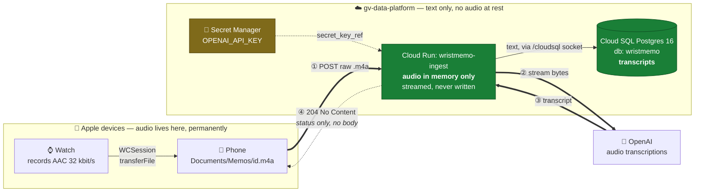
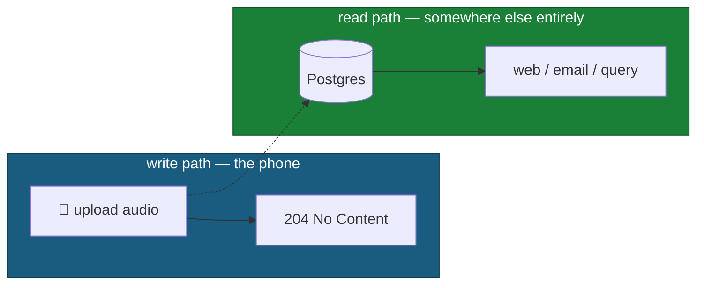
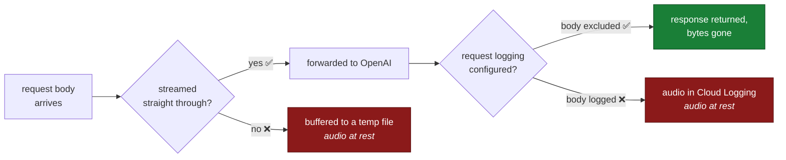
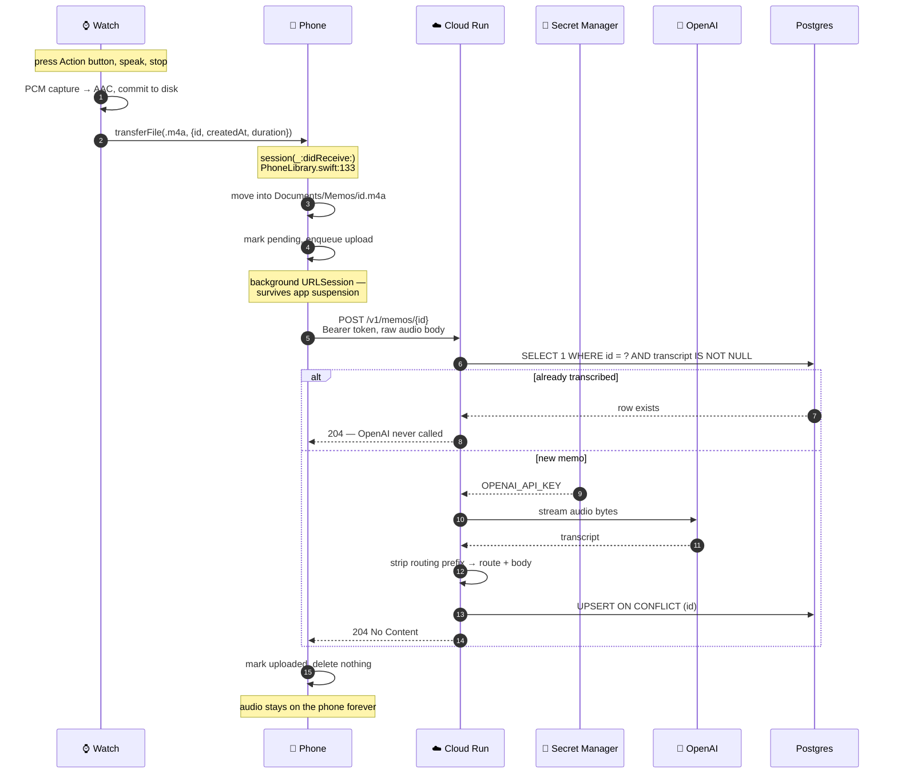
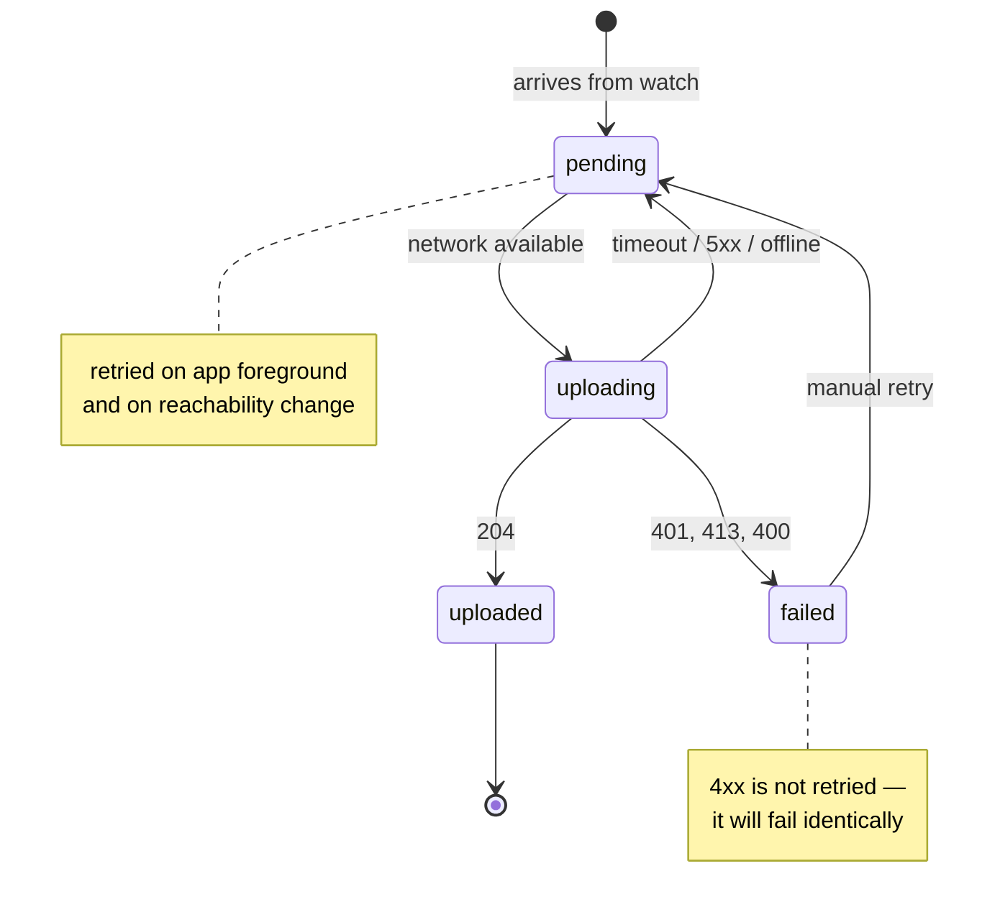
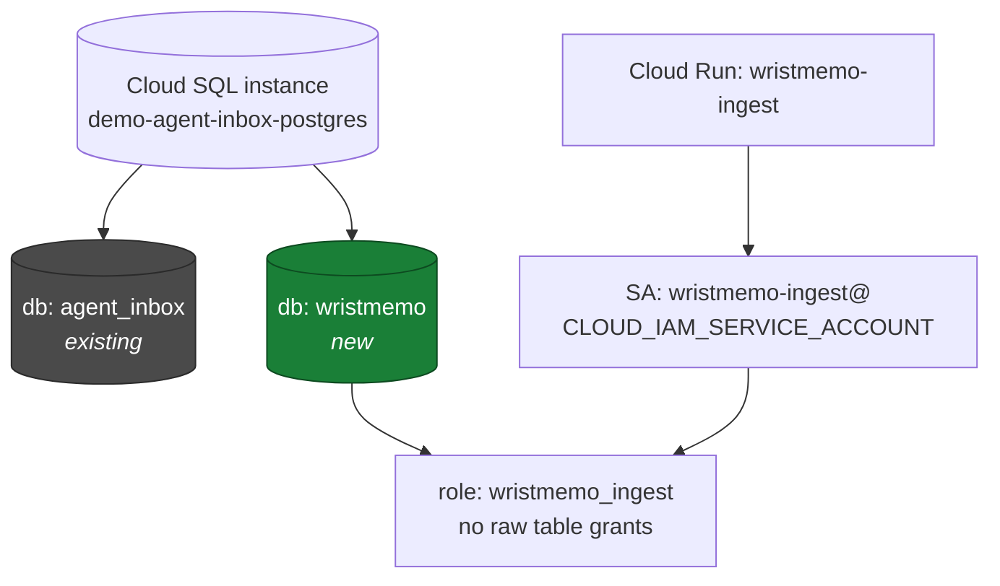
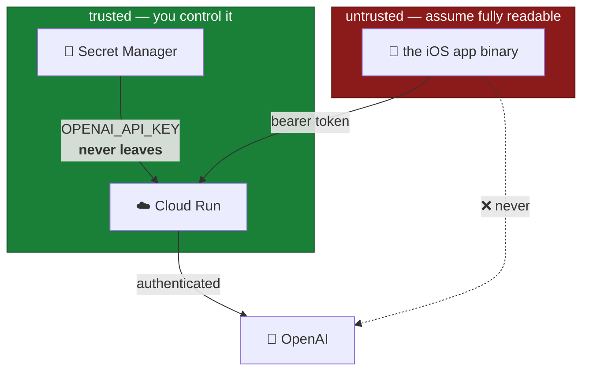

# Architecture

**Date:** 2026-08-06
**Status:** decided. This is the single source of truth for the cloud side.
What was considered and rejected is at the [bottom](#what-was-rejected).

Five rules, fixed:

1. The **cloud model** transcribes — not the on-device Speech framework.
2. The **OpenAI key lives in Cloud Run**, never in the app binary.
3. **Audio never rests in GCP.** Not in a bucket, not on disk, not in a log.
4. The **phone pumps the audio** to Cloud Run. The watch never talks to the cloud.
5. **One-way door.** The phone does not get the transcript back.

Rule 5 is the one that shrinks the build. Details in
[The one-way door](#the-one-way-door).

---

## This runs on infrastructure that already exists

`~/Projects/slop-apps` (`github.com/FrankLong1/slop-apps`) already operates a
Cloud SQL Postgres estate in the **`gv-data-platform`** project, `us-central1`,
with a Cloud Run service attached to it. WristMemo is a new database and a new
service on that same instance, not a new stack.

| Already built | Where | Reused as-is |
|---|---|---|
| Cloud SQL **Postgres 16** instance | `infra/agent-inbox/terraform/main.tf` | add one `google_sql_database` |
| Cloud Run → Cloud SQL over Unix socket at `/cloudsql` | `terraform/queue.tf`, `google_cloud_run_v2_service.queue` | copy the `volumes`/`volume_mounts` block |
| **IAM database auth** — no passwords, no SA keys | `cloudsql.iam_authentication = on` | new service account becomes a `CLOUD_IAM_SERVICE_ACCOUNT` sql_user |
| Secret Manager → env injection | `value_source.secret_key_ref` in `queue.tf` | this is where `OPENAI_API_KEY` goes |
| Artifact Registry + Cloud Build, immutable sha256 deploys | `queue_image` in `gv-data-platform.tfvars` | same pipeline |
| Checksummed migration ledger | `infra/agent-inbox/scripts/migrate.sh` | copy its pattern into `server/scripts/migrate.sh` |
| Connection pattern (`max: 5`, socket dir env) | `src/apps/inbox/src/server/agent-inbox.ts:148` | copy |

**Consequence: the marginal cost of Postgres here is $0.** The instance is
provisioned, protected, and backed up already. The entire cost case for
Firestore was Cloud SQL's always-on floor, and that floor is already paid.

**Consequence: the operational objections to Cloud SQL are already solved.**
No password to manage (IAM auth). No VPC connector (Unix socket volume). No
connection-pool surprise (`max: 5`, `min_instance_count = 0`). Choosing
Firestore now would mean introducing a second datastore paradigm next to a
Postgres estate that already works.

---

## The whole thing



The phone keeps the only permanent copy of the audio. GCP sees the bytes for one
request and keeps nothing but text. Arrow ④ is dotted because it carries no
content — only the status code that drives the retry queue.

---

## The one-way door

The phone uploads and forgets. Transcripts are read somewhere else entirely — a
web surface, an email, the existing inbox-style app — never in the watch or
phone UI.



**What this deletes from the build:**

- No transcript field on the phone's sidecar.
- No transcript rendering in `LibraryView`.
- No polling, no push, no "transcript arrived" state.
- No `GET /v1/memos` for the phone to backfill from.

The iOS work collapses to one thing: **a durable upload queue.** No new UI.

**The distinction that still matters:** one-way for *content*, not for
*acknowledgement*. The phone still needs the HTTP status, because that is what
drives retry. A `204` means the row is committed; anything else means try again.
Fire-and-forget the transcript, never the status code.

**The tradeoff, stated plainly:** a bad transcription is invisible from the
phone. You find out when you go read it. At personal scale that is fine — but it
does mean the read surface is not optional forever, it is just not part of *this*
build.

---

## Keeping audio out of GCP for real

"Never written" is an engineering claim, not a wish. Four rules make it true:



1. **Stream the body through** to OpenAI. Do not read it into a variable, do not
   write a temp file. The two easy ways to accidentally persist audio are a
   framework that spools large uploads to `/tmp` and a library that buffers the
   whole body to compute a length.
2. **Exclude the request body from logging.** Cloud Run's access logs don't
   capture bodies, but an application-level request logger added later might.
   This is the most likely way this rule quietly breaks.
3. **Raw body, not multipart.** `Content-Type: audio/mp4`, metadata in headers.
   Multipart parsers are exactly the libraries that spool to disk.
4. **No bucket in the project for this app.** If there is no GCS bucket, audio
   cannot end up in one by accident.

---

## The life of a memo



The watch's UUID is the primary key at every hop — it is already the filename on
both devices and already travels in the `transferFile` metadata. Step 10 means a
retry cannot duplicate a row *or* double-bill OpenAI.

---

## The phone's upload queue

Hop 1 already works this way (`WatchApp/WatchSyncClient.swift`). Hop 2 is the
same state machine one link further along.



**A background `URLSession` is mandatory.** WatchConnectivity delivers files by
launching the app in the background; a foreground-only upload would start, get
suspended, and lose the memo. A background session hands the transfer to the
system daemon, which completes it whether or not the app is alive.

**This is also why the body is raw rather than multipart** — a background session
can only upload *from a file*, and with a raw body `uploadTask(with:fromFile:)`
points straight at the existing `.m4a` and copies nothing.

---

## Isolation on a shared instance

The instance is shared with the agent inbox, so WristMemo gets its own
everything below the instance line. This mirrors how `agent_inbox_queue_observer`
is scoped in `migrations/0004`.



- **Its own database**, not a schema in `agent_inbox`. Clean blast radius.
- **Its own service account and SQL role.** The ingest identity can write memos
  and nothing else — it must not be able to read the agent inbox.
- **Its own migration runner**, `server/scripts/migrate.sh`, using the same
  checksummed-ledger pattern so drift fails closed the same way.

**The risk worth naming:** `db-f1-micro` is a shared-core tier, and its own
tfvars call it *"suitable only for this disposable, low-volume proof."* Voice
memos are tiny — a few thousand rows of text, single-digit MB — so capacity is
not the concern. Shared fate is: a runaway WristMemo query degrades the agent
inbox too. Acceptable at this volume, worth revisiting if either app grows.

---

## Trust boundaries



The app holds a **bearer token**, not the OpenAI key. A leaked token lets someone
transcribe on your bill — annoying, revocable, rate-limitable. A leaked OpenAI
key is your whole account.

Note the existing queue service uses **IAP** for browser auth. That does not work
here: IAP expects an interactive Google sign-in, and this endpoint is called by a
background daemon on a phone. `wristmemo-ingest` needs its own bearer-token check
against Secret Manager, with `ingress = INGRESS_TRAFFIC_ALL` and no IAP.

---

## Schema

```sql
CREATE TABLE wristmemo.memos (
  id             uuid PRIMARY KEY,     -- generated on the watch, reused end to end
  user_id        text NOT NULL,
  recorded_at    timestamptz NOT NULL,
  duration_s     real NOT NULL CHECK (duration_s > 0),
  transcript     text,                 -- verbatim, as the model returned it
  body           text,                 -- transcript with the routing prefix stripped
  route          text,                 -- 'investment idea' | 'follow up' | NULL
  model          text,
  language       text,
  transcribed_at timestamptz,
  created_at     timestamptz NOT NULL DEFAULT clock_timestamp(),
  updated_at     timestamptz NOT NULL DEFAULT clock_timestamp()
);

CREATE INDEX memos_user_recorded ON wristmemo.memos (user_id, recorded_at DESC);

ALTER TABLE wristmemo.memos ADD COLUMN search tsvector
  GENERATED ALWAYS AS (to_tsvector('english', coalesce(body, transcript, ''))) STORED;
CREATE INDEX memos_search ON wristmemo.memos USING gin (search);
```

`clock_timestamp()` rather than `now()`, matching `migrations/0001_agent_inbox.sql`.

Whether to follow the agent inbox's `SECURITY DEFINER`-functions-only pattern is
a judgement call. That design exists because two human identities share a
database and must not see each other's rows. WristMemo has one writer and one
reader, so plain table grants to `wristmemo_ingest` are defensible — but the
established house style is functions, and consistency has value.

---

## Endpoint

```
POST /v1/memos/{id}
  Authorization: Bearer <token>
  Content-Type: audio/mp4
  X-Recorded-At: <unix seconds>
  X-Duration: <seconds>
  body: raw .m4a bytes

  → 204  committed (or already committed — idempotent)
  → 503  the same memo is already in flight; retry after 30 seconds
  → 401  bad token
  → 413  over the size limit
  → 5xx  retry
```

One endpoint. No read API in this phase — that's the one-way door.

---

## What to build

| Layer | Work |
|---|---|
| **Terraform** | One `google_sql_database`, one service account, one `google_sql_user`, one Secret Manager secret, one `google_cloud_run_v2_service`. All copied from `queue.tf`. |
| **Migration** | `0001_wristmemo.sql` through `server/scripts/migrate.sh`'s independent, checksummed ledger |
| **Cloud Run** | Auth, dedupe, stream to OpenAI, strip prefix, upsert. Roughly 150 lines. |
| **iOS — new** | `iOSApp/TranscriptionClient.swift` — background session, queue, retry |
| **iOS — edit** | `PhoneLibrary.swift:133` enqueue · `PhoneLibrary.swift:19` sidecar gains an upload-state field |
| **iOS — UI** | **none** |
| **Project file** | New sources added to the `WristMemo` target's Sources phase **by hand** — there is no filesystem-synchronized group, so an unlisted file silently doesn't compile in |

### Cost

| Item | Monthly |
|---|---|
| Cloud SQL | **$0 marginal** — instance already running |
| Cloud Run (scales to zero) | ~$0 |
| Secret Manager | ~$0.06 |
| OpenAI transcription, ~300 min/mo | ~$1–2 |
| **Total** | **~$1–2** |

### Build order

1. Migration + Terraform, applied. Empty table, deployed service, `/readyz` green.
2. Cloud Run endpoint returning `204` with a **stubbed** transcript. Prove
   phone → Cloud Run → Postgres before OpenAI is involved.
3. Wire OpenAI. Test with `curl` and a real `.m4a` off the simulator.
4. iOS upload client — background session, queue, retry.
5. Routing prefix parser (server-side, so improving it is a deploy not a release).

---

## What was rejected

| Approach | Why not |
|---|---|
| **On-device Speech framework**, no cloud model | Accuracy is meaningfully worse on tickers and proper nouns — the exact words that matter for an investing corpus. |
| **Key in the iOS Keychain**, phone calls OpenAI directly | The only shape where audio never touches GCP at all, and viable for a single user. Rejected because the key must not be in a distributable app, and a scoped short-lived token is not an option — OpenAI issues ephemeral tokens for the Realtime API, not for transcription. |
| **Key compiled into the binary** | Extractable from a shipped iOS binary in minutes. |
| **Audio to GCS, object-finalize event, async worker** | The textbook shape. Buys free retries and the ability to re-transcribe the whole corpus against a future model. Costs audio files at rest, which is the one thing ruled out. **This is the single capability the chosen design gives up.** |
| **Firestore instead of Cloud SQL** | Its entire advantage was avoiding Cloud SQL's always-on cost floor — and that instance is already running and paid for. Against that, Firestore has no full-text search, so searching your own memos would need a second service bolted on. |
| **Returning the transcript to the phone** | Dropped deliberately. See [The one-way door](#the-one-way-door). |

## Verify before building

Read from config, not from live services:

- **The instance is actually running.** `gv-data-platform.tfvars` has a real
  image digest and `deletion_protection = true`, which strongly implies a live
  deployment — but confirm with `gcloud sql instances list --project=gv-data-platform`.
- **OpenAI model and pricing**, and that the 25 MB upload limit still holds.
  At 32 kbit/s that cap is ~100 minutes, so it is a guard, not a constraint.
- **`db-f1-micro` headroom** for a second database plus a second service's
  connections. Almost certainly fine; worth one look at instance metrics.
- **`pgvector` availability** on this instance, if semantic search is wanted
  later. Postgres 16 supports it; confirm the extension can be enabled.
