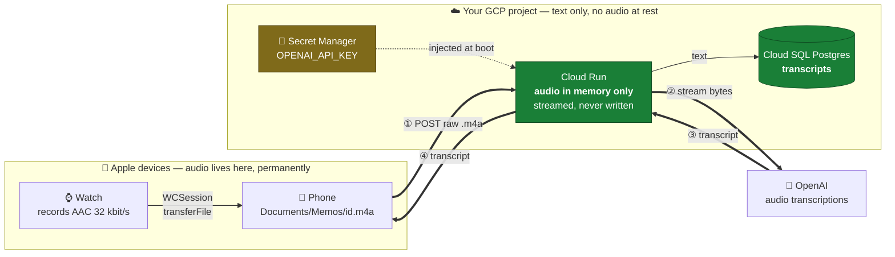
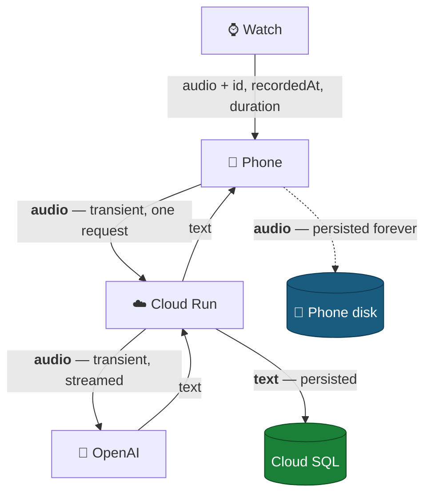
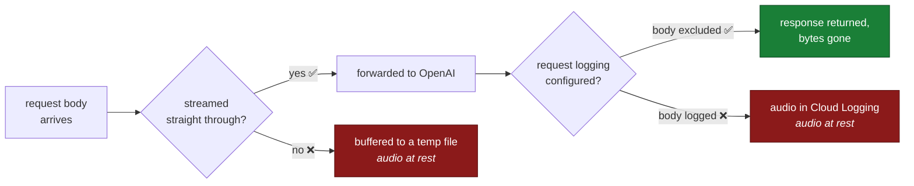
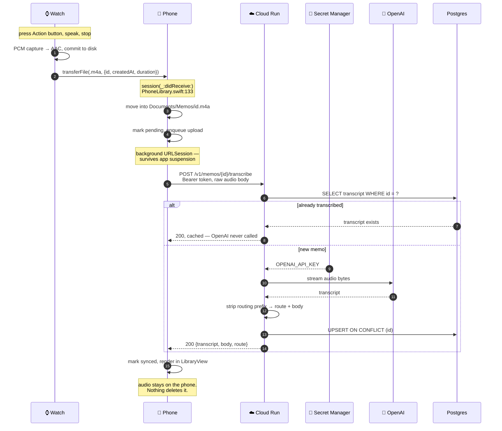
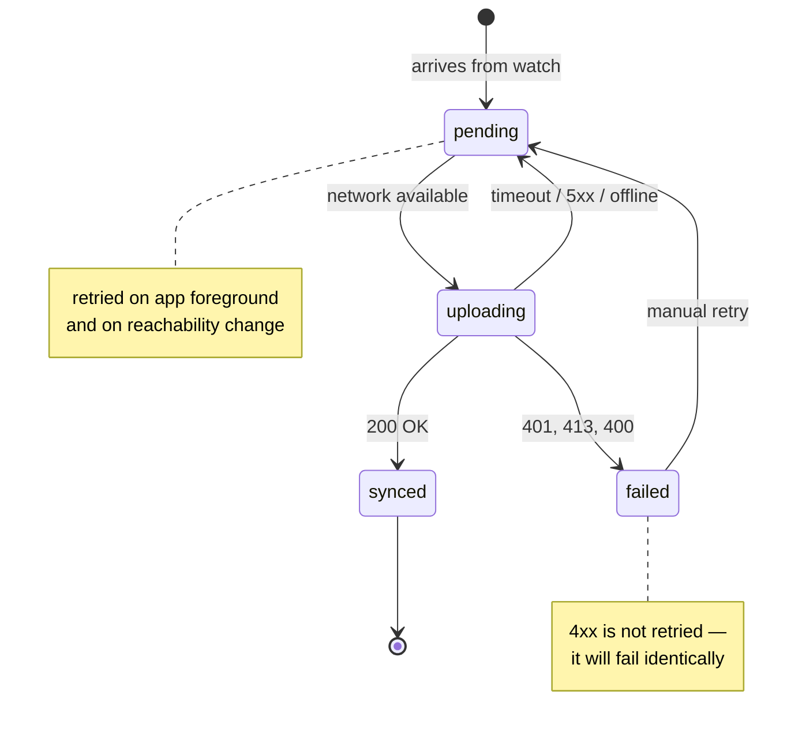
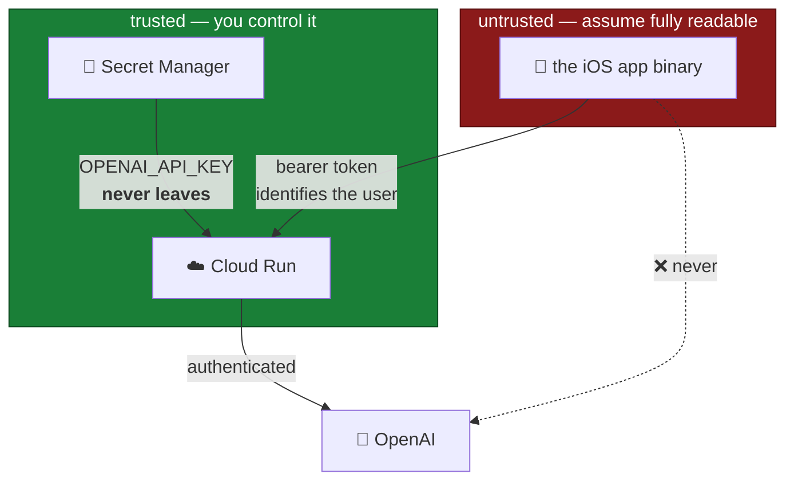

# Architecture

**Date:** 2026-08-06
**Status:** decided. This is the design. [BACKEND_APPROACHES.md](BACKEND_APPROACHES.md)
has the alternatives that were considered and why they lost.

Four rules, fixed:

1. The **cloud model** transcribes — not the on-device Speech framework.
2. The **OpenAI key lives in Cloud Run**, never in the app binary.
3. **Audio never rests in GCP.** Not in a bucket, not on disk, not in a log.
4. The **phone pumps the audio** to Cloud Run. The watch never talks to the cloud.

---

## The whole thing

The phone keeps the only permanent copy of the audio. GCP sees the bytes for the
duration of one request and keeps nothing.

---

## What crosses each boundary

Only two things are ever written to durable storage: **audio on the phone**, and
**text in Postgres**. Everything else is in flight.

---

## Keeping audio out of GCP for real

"Never written" is an engineering claim, not a wish. Four rules make it true:

1. **Stream the body through** to OpenAI. Do not read it into a variable, do not
   write a temp file. The two easy ways to accidentally persist audio are a
   framework that spools large uploads to `/tmp` and a library that buffers the
   whole body to compute a length.
2. **Exclude the request body from logging.** Cloud Run's default access logs
   don't capture bodies, but an application-level request logger added later
   might. This is the most likely way this rule quietly breaks.
3. **Raw body, not multipart.** `Content-Type: audio/mp4`, metadata in headers.
   Multipart parsers are exactly the libraries that spool to disk.
4. **No bucket in the project.** If there is no GCS bucket, audio cannot end up
   in one by accident.

---

## The life of a memo

The watch's UUID is the primary key at every hop — it is already the filename on
both devices and already travels in the `transferFile` metadata. A retried
upload cannot duplicate a row, and step 10 means a retry cannot double-bill
OpenAI either.

---

## The phone's upload queue

Hop 1 already works this way (`WatchApp/WatchSyncClient.swift`). Hop 2 is the
same state machine one link further along.

**A background `URLSession` is mandatory.** WatchConnectivity delivers files by
launching the app in the background; a foreground-only upload would start, get
suspended, and lose the memo. A background session hands the transfer to the
system daemon, which completes it whether or not the app is alive.

**This is also why the body is raw rather than multipart** — a background session
can only upload *from a file*, and with a raw body `uploadTask(with:fromFile:)`
points straight at the existing `.m4a` and copies nothing.

---

## Trust boundaries

The app holds a **bearer token**, not the OpenAI key. Worst case, a leaked token
lets someone transcribe audio on your bill — annoying, revocable, rate-limitable.
A leaked OpenAI key is your whole account.

The dotted line is the property being bought: **the app can never call OpenAI
directly**, because it has nothing to call with.

---

## What to build

| Layer | Work |
|---|---|
| **GCP** | One Cloud Run service, one Cloud SQL Postgres instance, one secret. Same region. |
| **Cloud Run** | `POST /v1/memos/{id}/transcribe` — auth, dedupe, stream to OpenAI, strip prefix, upsert. Roughly 200 lines. |
| **iOS — new** | `iOSApp/TranscriptionClient.swift` — background session, queue, retry |
| **iOS — edit** | `PhoneLibrary.swift:133` enqueue · `PhoneLibrary.swift:19` sidecar grows state + transcript · `LibraryView.swift` shows it |
| **Project file** | New sources added to the `WristMemo` target's Sources phase **by hand** — there is no filesystem-synchronized group, so an unlisted file silently doesn't compile in |

Schema, endpoint detail, cost and build order are in [BACKEND.md](BACKEND.md).
