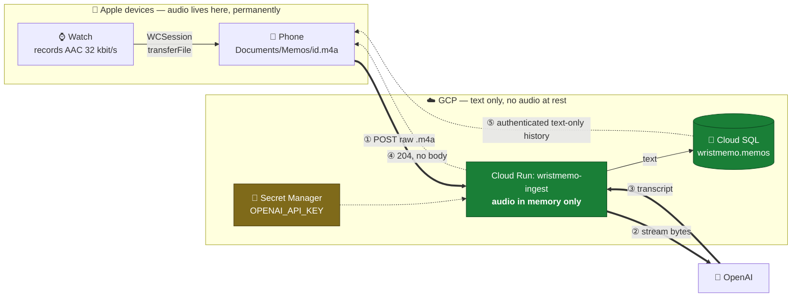
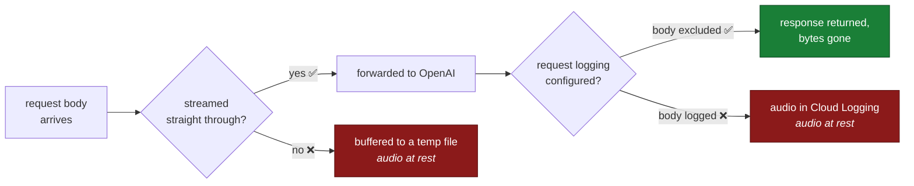
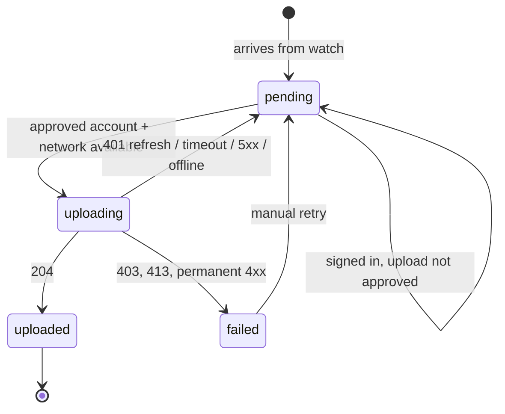
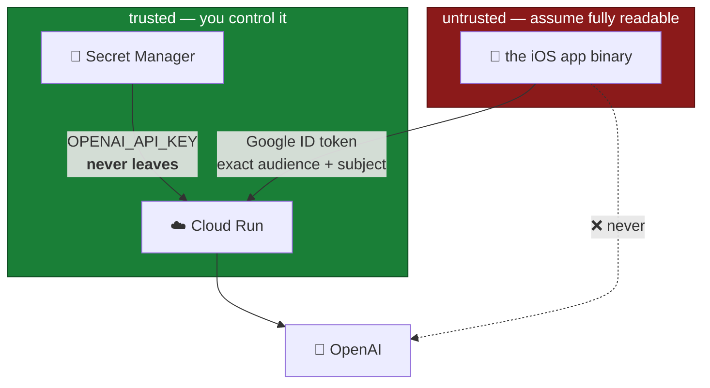

# Architecture 1 — capture to transcript

**Date:** 2026-08-06
**Status:** **live.** Deployed and verified end to end.

Covers everything up to the moment a transcript is committed. After that is
[2_AGENT_ARCHITECTURE.md](2_AGENT_ARCHITECTURE.md).

Endpoint spec, deploy runbook and what was verified live are in
[`src/server/README.md`](../../src/server/README.md). This file is *why*, not
*how to run it*.

Five rules, fixed:

1. The **cloud model** transcribes — not the on-device Speech framework.
2. The **OpenAI key lives in Cloud Run**, never in the app binary.
3. **Audio never rests in GCP.** Not in a bucket, not on disk, not in a log.
4. The **phone pumps the audio**. The watch never talks to the cloud.
5. **Separate capture and review paths.** Upload responses are status-only;
   the authenticated phone later pulls its owner's transcript history.

---

## The flow

The phone keeps the only permanent copy of the audio. GCP sees the bytes for one
request and keeps nothing but text.

The watch's UUID is the primary key at every hop — already the filename on both
devices, already in the `transferFile` metadata. Cloud Run checks it before
calling OpenAI, so a retry can neither duplicate a row nor double-bill.

---

## Keeping audio out of GCP for real

"Never written" is an engineering claim, not a wish. Four rules make it true:

1. **Stream the body through.** Never read it into a variable or a temp file.
2. **Exclude the request body from logging.** Cloud Run's access logs don't
   capture bodies, but an app-level logger added later might. This is the most
   likely way the rule quietly breaks.
3. **Raw body, not multipart.** Multipart parsers are exactly the libraries that
   spool to disk.
4. **No bucket in the project.** Audio cannot land in one that doesn't exist.

---

## Capture upload and transcript review are separate

The phone still uploads a file and receives only the exact `204` receipt that
drives retry. It never receives transcript content on the audio upload path.
Google Sign-In is deliberately read-only at first: authenticating never implies
permission to send the existing audio backlog. The phone shows the exact pending
recording count and requires a second confirmation before it persists upload
permission for that immutable Google account. Signing out revokes that
permission and cancels active uploads back to `pending`.

After sign-in, the companion can make a separate, authenticated, text-only
cursor request for the owner's transcript history and stores that cache in its
protected app container. The Watch remains content-out only: no transcript is
sent back to the wrist.

This gives the user an iPhone review and search surface, including an explicit
“transcribing” state while a memo is still in flight. It also makes a bad
transcription inspectable while the temporary local source audio is available.
The workstation watcher remains a different trust boundary and still receives
only UUID plus transcription timestamp.

**A background `URLSession` is mandatory.** WatchConnectivity delivers files by
launching the app in the background; a foreground-only upload would start, get
suspended, and lose the memo. It also only uploads *from a file* — which is why
the endpoint takes a raw body, letting it point straight at the stored `.m4a`.

---

## Trust boundaries

Cloud Run is reachable at the platform layer because the phone's ID token is
for WristMemo's OAuth server client, not Cloud Run IAM's service URL. The
application verifies Google's signature, issuer, exact audience, expiry and the
user's immutable `sub` before it reads the audio stream. Initial sign-in is
interactive but does not upload audio. A separate, counted confirmation binds
automatic uploads to that exact `sub`; later background uploads silently refresh
the Google session while that authorization remains in force.

The iOS OAuth client is protected with Google OAuth App Check backed by Apple
App Attest. That protects the sign-in/token issuance path from modified clients;
the server-side subject allowlist independently limits who can upload. The
OpenAI key remains the highest-value secret and never leaves Cloud Run.

---

## Sharing the instance

WristMemo runs on a Cloud SQL instance owned by a separate, private project, so
it gets its own database, service account and SQL role — never a schema inside
the neighbour's. Verified live: the ingest identity is refused on the
neighbouring schema, *permission denied*.

That reuse is also why Postgres cost nothing here, which is what killed the case
for Firestore. Running total is ~$1–2/month, essentially all OpenAI.

**The risk worth naming:** `db-f1-micro` is shared-core. Capacity isn't the
concern — memos are single-digit MB — but a runaway WristMemo query would
degrade the neighbouring service too.

---

## What was rejected

| Approach | Why not |
|---|---|
| **On-device Speech framework** | Accuracy is worse on tickers and proper nouns — the words that matter here. |
| **Key in the iOS Keychain**, phone calls OpenAI directly | The only shape where audio never touches GCP at all, and fine for one user. But the key can't ship in a distributable app, and OpenAI has no scoped token for transcription — only for Realtime. |
| **Key compiled into the binary** | Extractable from a shipped iOS binary in minutes. |
| **Audio to GCS, event, async worker** | The textbook shape. Buys free retries and re-transcribing the corpus against a future model — **the one capability this design gives up.** Costs audio files at rest, which was ruled out. |
| **Firestore instead of Cloud SQL** | Its whole advantage was avoiding Cloud SQL's cost floor, already paid. And it has no full-text search, so searching your own memos would need a second service. |
| **Putting the transcript in the audio-upload response** | Dropped — the background upload receipt remains a small, status-only acknowledgement. The phone pulls its own text history later through a separately authenticated read API. |
