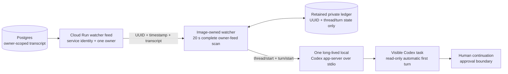

# Architecture 2 — transcript to visible Codex task

**Date:** 2026-08-08
**Status:** implemented in this repository; Cloud Run and external workstation
image rollout remain deployment steps.

Stage 1 ([1_INGEST_ARCHITECTURE.md](1_INGEST_ARCHITECTURE.md)) ends with an
owner-scoped transcript row in Postgres. This stage creates one visible Codex
task for each new non-empty transcript. Polling is the authoritative delivery
mechanism. There is no Pub/Sub and no custom WebSocket.

## Exact flow



The watch UUID remains the identity at every hop. The watcher never receives
audio, never writes transcript text to its state or logs, and never connects to
Cloud SQL directly.

## Feed authorization and owner isolation

Cloud Run verifies the attached workstation service account's short-lived
Google ID token against the OAuth audience and service-account allowlist. That
authentication is necessary but not sufficient: server configuration also
requires exactly one `GOOGLE_WATCHER_OWNER_SUBJECT`. The service derives
`google:<subject>` and passes it into every watcher database query.

Both the cursor feed and UUID re-fetch require:

```sql
WHERE user_id = $configured_owner
  AND transcript IS NOT NULL
  AND btrim(transcript) <> ''
```

The workstation identity cannot select another user's transcript. Empty
transcripts do not create tasks.

## Cursor correctness

Postgres `transcribed_at` is assigned before commit. A transaction with an
earlier timestamp can commit after the watcher has observed and advanced past a
newer transaction. A strict `(transcribed_at, id) > cursor` poll can therefore
skip a committed memo.

The production cursor is an observable high-water mark, not a discovery
boundary. Every poll pages through the complete owner-scoped feed from the
beginning and deduplicates against the durable UUID ledger. A transaction that
commits arbitrarily long after its timestamp was assigned is therefore found on
the next poll; already submitted UUIDs are not re-created. The watcher persists
and processes one page before fetching the next, keeping memory bounded even as
history grows. Page processing touches only that page's UUID records, unchanged
historical pages do not rewrite the ledger, and one fallback ledger scan after
the feed pass handles missing repair records. Pending items
re-fetch their transcript by UUID, so the watcher does not retain transcript
text merely to retry.

This is intentionally at-least-once complete discovery plus local dedupe. The
full rescan is observable in status and favors correctness over an unsafe
finite cursor window.

## Durable task state and duplicate protection

Each UUID has one atomic ledger record. State replacement fsyncs both the new
file and its containing directory. The watcher durably persists boundaries
before crossing them:

```mermaid
stateDiagram-v2
    [*] --> pending
    pending --> threadUncertain: persist request marker; thread/start response lost
    pending --> threadKnown: persist returned threadId
    threadKnown --> turnUncertain: persist marker; turn/start response lost
    threadKnown --> submitted: persist returned turnId
    pending --> failed: bounded pre-boundary attempts exhausted
    failed --> pending: explicit safe repair
    threadUncertain --> pending: human confirms no task exists
    turnUncertain --> [*]: inspect or continue existing task; never create another
    submitted --> [*]
```



A crash with a durable `threadId` but no turn request resumes that thread and
cannot create a second visible task. Once `thread/start` may have been received
without a returned ID, automatic retry stops. Once `turn/start` may have been
received, the existing task is the only repair surface. This conservative
boundary is more important than pretending Cloud Run, the local ledger, and
Codex share an atomic transaction.

Retryable pre-boundary failures back off from 20 seconds to ten minutes and
become terminal after five attempts. Processing never stops at one pending or
failed memo, so a permanent failure cannot hold later memos behind it. Status
shows pending, terminal, and uncertain attention records.

## Read-only automatic turn

The transcript is wrapped in a fixed instruction that identifies it as
untrusted text and asks for a useful answer, plan, or draft. The first turn
runs with:

- the canonical configured project as `cwd`;
- approval policy `never`;
- a read-only sandbox;
- turn network access disabled;
- MCP configuration overridden to empty; and
- an explicit prohibition on plugins, apps, MCP, skills, workspace writes, and
  consequential external actions.

This is defense in depth against a mis-transcription or prompt-like spoken
content. The automatic turn may inspect and reason. It may not implement. A
human continuation in the visible task is the approval boundary for a later
write or external action.

## Long-lived app-server

The watcher owns one local `codex app-server --stdio` child. It performs the
documented `initialize`, `thread/list`, `thread/start`/`thread/resume`, and
`turn/start` flow. Submission is complete when `turn/start` returns an
in-progress turn ID. The watcher does not wait for the model to finish and does
not terminate a realistic turn on a task timeout. It continues polling and can
submit later memos while prior read-only turns run.

The app-server's stderr is drained and discarded. A `finally` boundary closes
it on normal shutdown and every exceptional watcher exit; the supervisor then
restarts the whole controlled pair.

## Desktop visibility compatibility

App Server is the documented rich-client protocol. The Codex desktop app's
discovery of a thread created by a separate app-server process is not a
documented task-creation API. The watcher therefore treats it as an explicit,
experimental compatibility dependency.

Health starts the image-provided Codex server, records its returned user agent,
and exercises `thread/list` against the exact project. A version change is
accepted when the required protocol still works. A protocol failure makes
health red and prevents task submission; desktop visibility remains a manual
post-rollout acceptance check because cross-process discovery is experimental.

## Image/runtime ownership

This repository owns a versioned `1.0.3` payload and image-layer installer:

```text
src/watcher/VERSION
src/watcher/image/build-artifact.sh
src/watcher/image/install-image-layer.sh
src/watcher/image/245-wristmemo-watcher.sh
```

The installer places immutable code under `/opt/wristmemo-watcher/<version>`,
updates an observable `current` symlink, and installs the image startup hook.
Runtime config remains private under `~/.config/wristmemo-watcher`; the ledger,
lock, PIDs, and logs remain under `~/.local/state/wristmemo-watcher`. Identity
tokens remain in memory and come from the attached service account.

The actual Frank workstation image is owned by the external repository at
`frank-vm-sandbox/container-images/demo-workstation-image/profiles/frank/`.
That Frank-only profile vendors this versioned payload, verifies its reviewed
SHA-256, runs the installer, and exercises the immutable/runtime boundary in
its profile smoke and image-contract tests. Neither repository builds,
publishes, deploys, or retargets the external image as part of this change.
