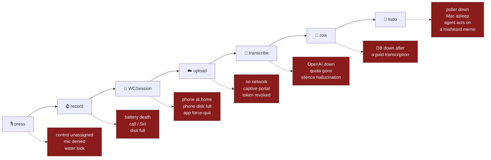
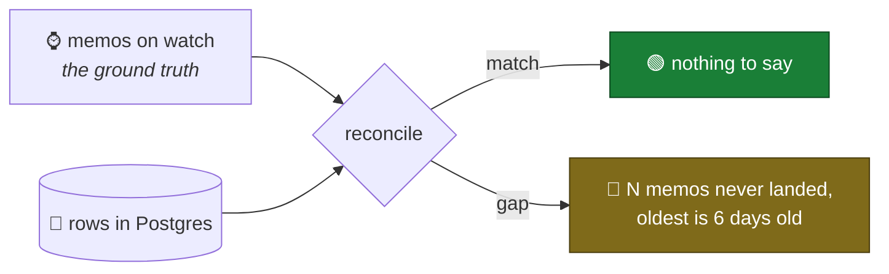

# Failure modes

**Date:** 2026-08-08
**Status:** brainstorm. Nothing here is a bug report yet — it is the catalogue
of ways a spoken thought fails to become a row in Postgres, and what the system
does about each one today.

Companion to [LIMITATIONS.md](LIMITATIONS.md), which covers what Apple *forbids*.
This covers what *breaks*.

---

## The shape of the problem

Two properties dominate everything below.

**1. Audio is never deleted while it is stuck, so almost nothing is truly
lost.** The memo is committed to watch storage before any transfer is attempted
([`MemoStore.finalize`](../../src/swift_app/WatchApp/Storage/MemoStore.swift)), and neither leg deletes its
source. Most failures are *stalls*, not losses.

Each device does eventually delete its copy — 24 h after the next hop has taken
it ([`Retention`](../../src/swift_app/Shared/Policy/Retention.swift)) — but every failure in this document
leaves the memo in a state the sweep skips, so a stall preserves the audio for
exactly as long as the stall lasts. What this property no longer covers is a
memo that moves on *successfully* and is then lost further downstream: once the
service has answered its exact `204 No Content` receipt, the audio has a day left and the transcript is the
only record.

**2. A stall is visible only when someone opens the review surface.** The phone
now renders pending, uploading, failed, and transcribed memos, then caches the
owner's readable transcript history. That makes the failure signature
inspectable rather than structurally invisible, but it does not make the Watch
wait for or poll the network. A person who never opens the phone can still find
out late that a thought did not arrive.

That is the real risk in this design. Not loss — *undetected* loss of service.

### Legend

| Class | Meaning |
|---|---|
| 🔴 **Silent loss** | The memo, or its content, never arrives and nothing says so |
| 🟠 **Silent wrong** | Something *does* arrive, but it is incorrect — worse than nothing, because it is trusted |
| 🟡 **Stall** | Delivery is deferred, recovers on its own, invisible while it lasts |
| 🔵 **Visible** | The user or a log sees it at the time |
| 💸 **Cost** | Money, not data |

---

## Stage 0 — the press, before there is any audio

The most under-defended stage, because nothing here has a file to fall back on.
A failed press produces **nothing at all**: no memo, no log, no trace that a
thought existed.

| Failure | What happens today | Class |
|---|---|---|
| Control never assigned to the Action button | Press does whatever the previous assignment did. App is never involved | 🔴 |
| App never launched once after install | The control isn't registered, so it cannot be assigned | 🔵 |
| Mic permission undetermined on first press | Intent foregrounds the app, `startRecording` requests permission ([`RecorderModel.swift:197`](../../src/swift_app/WatchApp/Capture/RecorderModel.swift)) — a prompt appears, and **the user is already talking** | 🔴 |
| Mic permission denied | `requestPermission` returns false, `MIC OFF / ALLOW IN SETTINGS` stays on screen, no recording | 🔵 |
| Water Lock active (Ultra, swimming) | Presses are swallowed by watchOS | 🔵 |
| Theater Mode / Sleep Focus | Screen stays dark; the app foregrounds but the user gets no visual confirmation, only the haptic | 🟡 |
| Watch passcode-locked (off wrist, just put on) | Unlock required before the app can foreground; speech during that window is lost | 🔴 |
| Watch busy: on a call, in Walkie-Talkie, mid-Siri | Foregrounding competes with an audio-owning app; activation may fail → **MIC BUSY** | 🔵 |
| Storage full at press time | `store.newCaptureURL` throws → **STORAGE FULL** on screen | 🔵 |
| Double press while already recording | `startRecording` guards on `phase`/`startInFlight` and returns — the second press is a no-op, **which looks identical to a press that failed** | 🟡 |
| Cold-launch latency exceeds the user's patience | The first ~1 s of speech lands before `record()` returns. Pre-arming ([`prearm`](../../src/swift_app/WatchApp/Capture/RecordingEngine.swift)) shortens this; it cannot remove it | 🟠 |

**The clipped-first-word case deserves its own line.** It is the only failure
here that is *guaranteed on every press* rather than occasional, it is invisible
(the memo exists, it just starts mid-sentence), and it corrupts exactly the part
of a memo that carries the routing prefix — "investment idea:" becomes "vestment
idea:" and `parseRoute` files it under nothing. See the
[friction budget](LATENCY.md).

---

## Stage 1 — recording

Best-defended stage. PCM-in-CAF plus orphan recovery means a killed process
still leaves a decodable file
([`recoverOrphanedCaptures`](../../src/swift_app/WatchApp/Storage/MemoStore.swift)).

| Failure | What happens today | Class |
|---|---|---|
| Phone call arrives mid-recording | `AVAudioSession` interruption → pause, auto-resume on `.shouldResume` ([`handleInterruption`](../../src/swift_app/WatchApp/Capture/RecorderModel.swift)) — the memo has a gap but stays one file | 🟠 |
| Siri invoked mid-recording (raise-to-speak, misfire) | Same interruption path. A wrist raise while talking can silently pause the memo | 🟠 |
| Battery reaches 5% | Polled every ~5 s, auto-saves ([`checkBattery`](../../src/swift_app/WatchApp/Capture/RecorderModel.swift)) | 🔵 |
| Battery dies above 5%, or a hard shutdown | Capture survives as PCM-CAF, recovered on next launch | 🟡 |
| System kills the app (memory / thermal) | Same recovery path | 🟡 |
| Wrist drops, app backgrounds | `WKBackgroundModes: audio` keeps it running under tighter CPU limits; watchOS may still suspend | 🟠 |
| Disk fills mid-recording | `audioRecorderEncodeErrorDidOccur` → `onUnexpectedStop`; partial capture is finalized | 🔵 |
| AAC compression fails at save | Raw `.caf` is kept instead — "a large memo beats a lost one" ([`finalize`](../../src/swift_app/WatchApp/Storage/MemoStore.swift)). The phone atomically normalises it to M4A before ingest; if that fails, the CAF remains locally pending rather than being mislabelled | 🟡 |
| Header-only pre-arm file | Discarded: it has no recorded samples. Any file containing audio, however short, is retained. | 🟡 |
| User forgets to stop; memo runs for hours | AAC 32 kbit/s ≈ 240 KB/min → the 25 MB server cap is ~104 min. A raw CAF fallback is normalised on the phone before it is eligible for upload, so it cannot reach the server under a false type | 🟡 |
| Watch reboots mid-recording | Orphan recovery, as above | 🟡 |
| Microphone occluded (sleeve, rain, Ultra's siren port wet) | Silent or garbled audio. Nothing checks the level before committing | 🟠 |

**The compression fallback is now an explicit deferred conversion.** The watch
keeps the decodable CAF, the phone commits it before acknowledging the watch,
then produces an M4A atomically. The ingest client and service both require an
explicit M4A declaration, so a raw capture cannot be forwarded under a false
MIME type.

---

## Stage 2 — watch → phone (`WCSession.transferFile`)

Timing here is measured in minutes and is entirely at the system's discretion.

| Failure | What happens today | Class |
|---|---|---|
| Phone left at home / out of Bluetooth range and off WiFi | Transfer queues on the watch indefinitely. This is the first red box in [1a_UPLOAD_PATHS.md](../architecture/1a_UPLOAD_PATHS.md) | 🟡→🔴 |
| Phone battery dead for a day | Same |  🟡 |
| Companion iOS app deleted | `transferFile` has no counterpart; transfers never complete | 🔴 |
| User force-quits the iOS app from the app switcher | iOS deprioritises relaunching a user-terminated app for background delivery. Memos may sit until the app is opened manually | 🔴 |
| Watch unpaired and re-paired | `sessionDidDeactivate` → re-activate. Watch-side memos survive; whether the queue does is unverified | 🟠 |
| Watch reset / restored from backup | App container is gone. **Un-synced audio is gone with it** — the only copy | 🔴 |
| Phone storage full when the file arrives | The phone cannot commit the file/sidecar, so it sends no receipt. The watch retains its source and does not begin retention | 🟡 |
| Transfer metadata missing or malformed | The phone rejects it and never mints a replacement UUID. The watch retains the original source, so this is recoverable rather than a duplicate upload | 🟡 |
| One transfer wedges | Pending transfers are considered independently by UUID; a wedged transfer no longer blocks later memos | 🔵 |
| Airplane mode on the watch | Queued; retried on reachability change | 🟡 |
| Large backlog after a week apart | Delivered on the system's schedule, serially, over BLE — could be hours | 🟡 |

**The durable receipt closes the import-failure divergence.** A
`transferFile` completion is transport status only; the watch becomes `.synced`
only after the phone writes both audio and sidecar, then queues the original UUID
back to the watch. A failed import therefore preserves the watch source and its
retention clock never starts.

---

## Stage 3 — phone → Cloud Run

| Failure | What happens today | Class |
|---|---|---|
| No network at all | Background session `waitsForConnectivity`; the OS resumes it later | 🟡 |
| **Captive portal** (hotel, airport, café WiFi) | A portal's `200` is not WristMemo's exact `204 No Content` receipt. The phone leaves the memo pending and retries | 🟡 |
| User has not completed Google Sign-In | Audio stays `pending`; the phone library offers the one setup action that enables authenticated automatic transcription and transcript history | 🟡 |
| User signs out or changes Google account | Active tasks cancel back to `pending`; a restored Google session resumes the durable queue automatically | 🔵 |
| Large backlog starts together | The phone's background session owns one upload lane and advances only after the active task completes; the remaining audio stays durably `pending` | 🔵 |
| An older build persisted backlog rate limits as terminal failures | A one-shot signed-in migration returns those legacy `failed` sidecars to the serial queue. New `408`, `425`, and `429` responses remain `pending` with backoff | 🔵 |
| Device rebooted, not yet unlocked | Google session restoration may wait until protected credential storage is available; audio remains pending and is reconciled on the next activation | 🟡 |
| Google ID token expires or is rejected | `401` returns the memo to `pending`; the next attempt silently refreshes the Google session. If restoration needs interaction, the phone shows signed out | 🟡 |
| Wrong Google account | Exact verified `sub` allowlist returns `403` → terminal `failed`; changing to the allowed account makes manual retry safe | 🔴 |
| Memo over 25 MB | `413` → `failed`, permanent | 🔴 |
| Low Data Mode / cellular disabled for the app | Deferred until WiFi | 🟡 |
| Cloud Run scaled to zero | Cold start ~1 s, absorbed by the retry policy | 🟡 |
| Server 5xx | `pending` + backoff 30 s → 30 min | 🟡 |
| Server rate-limits with `429` | `pending` + backoff 30 s → 30 min; it is never treated as malformed audio | 🟡 |
| Shared Cloud SQL connection slots exhausted | The phone receives `503` and preserves the memo for retry. Normal phone delivery is serial; Cloud Run is capped at one instance with a two-connection process pool, keeping the shared database within its usable slot budget. | 🟡 |
| Retry backoff never fires | The retry `Task` dies with the process. Recovery depends on `didBecomeActive` or a WatchConnectivity relaunch; the phone library now exposes the pending/failed memo, but cannot repair it while never opened | 🔴 |
| Endpoint URL changed (new Cloud Run revision, new domain) | DNS/TLS failure → infinite retry against a dead host | 🔴 |
| A live Google ID token is stolen | It is audience-bound, subject-bound, and short-lived, but replay remains possible until expiry; OAuth App Check/App Attest reduces issuance from modified clients | 💸 |
| Public endpoint gets scanned / abused | Google signature/audience/subject verification rejects requests before audio is read, but request volume can still bill Cloud Run | 💸 |

**Captive portals stay important because they delay delivery, but they no longer
produce a false success.** The exact receipt keeps the memo pending, and the
ordinary retry policy gets another chance after the user completes the portal.

---

## Stage 4 — Cloud Run → OpenAI → Postgres

| Failure | What happens today | Class |
|---|---|---|
| OpenAI down or rate-limiting | `502` → phone retries, backing off to 30 min | 🟡 |
| OpenAI credits exhausted | Same `502`, but it will *never* succeed. Retries forever, silently | 🔴 |
| Bad `OPENAI_MODEL` | Boots clean, fails on the first real memo as `502` — named in [server/README.md](../../src/server/README.md) | 🔴 |
| **Postgres unavailable after a successful transcription** | `503` → the phone retries → `isTranscribed` is still false → **the memo is transcribed and billed a second time**. The idempotency key is only written on a successful save | 💸 |
| DB unavailable before | `503`, retried cleanly | 🟡 |
| Two overlapping requests for one memo | Advisory lock → `503` + `Retry-After: 30` | 🟡 |
| Neighbouring service saturates the shared `db-f1-micro` | `503`s, and WristMemo can degrade the neighbour in the other direction | 🟠 |
| Transcript is silence | Whisper-family models hallucinate on silence ("Thank you for watching"). A confident, wrong row is stored | 🟠 |
| Transcription returns zero words | Stored as a durable no-content outcome so retries cannot rebill it, but excluded from the phone library and watcher feed | 🔵 |
| Proper nouns, tickers, accents mis-heard | The exact words this app exists to capture. Stored as fact | 🟠 |
| Routing prefix mis-transcribed | `parseRoute` finds nothing → the memo files under no route and never reaches the right agent | 🟠 |
| Request exceeds Cloud Run's timeout | Transcription is capped at 4 min; a long memo can outlive the platform timeout, producing a `502`-shaped stall | 🟡 |
| Secret rotated without redeploy | Old instances keep the old key until they cycle | 🟠 |
| Bad revision deployed | Every memo `500`s until rolled back. Nothing alerts | 🔴 |

**Everything from "transcript is silence" down is the 🟠 class.** The
authenticated phone library now makes the transcript reviewable and searchable,
with original-audio playback while its temporary retained copy exists. The
remaining risk is that the person does not review it before that local audio
retention window ends.

---

## Stage 5 — transcription receipt → app-visible Codex task

The production repository implementation passes each new non-empty transcript
for one configured owner into one visible Codex task. Polling every 20 seconds
is authoritative. The automatic first turn is read-only; a human continuation
is required before any workspace edit or consequential action. Cloud Run and
the external Frank workstation image still require an approved rollout before
this replaces the earlier live wiring proof.

| Failure | What happens today | Class |
|---|---|---|
| Watcher child crashes | Its supervisor restarts it after five seconds; the image-owned workstation hook starts the supervisor after recreation/restart when private runtime config exists | 🔵 |
| Cloud Workstation is stopped | Transcripts remain in Postgres and are discovered after the workstation runs again; availability remains bounded by workstation lifecycle | 🟡 |
| Feed fails or hangs | The request aborts after 10 seconds; durable health records a generic failure and backs off from 20 seconds to ten minutes. Status becomes stale after four missed normal polls | 🔵 |
| A transaction commits behind the cursor | Every poll overlaps ten minutes and deduplicates by durable memo UUID; focused tests cover a delayed earlier timestamp arriving after a later row | 🟡 |
| More rows exist than one overlap page | The watcher paginates the complete overlap instead of repeatedly reading only its first page | 🟡 |
| Old pending memo falls outside overlap | The transcript is re-fetched by UUID through the same one-owner authorization query; it is not retained in watcher state | 🟡 |
| One memo fails permanently before task creation | Five bounded attempts lead to terminal `failed`; the attention list stays red and later memos continue | 🔵 |
| App-server fails before `thread/start` is sent | The memo remains retryable until the bounded terminal threshold; no task may exist yet | 🟡 |
| Watcher stops after `thread/start` may have been sent | The record becomes `interrupted` without a returned ID. Automatic retry is refused; a human must inspect recent tasks and explicitly confirm when none exists | 🔵 |
| Watcher stops after a thread ID but before a turn request | It resumes the known thread and sends the transcript without creating a second visible task | 🟡 |
| Watcher stops after `turn/start` may have been sent | It never starts another task or automatically resends the turn. The human inspects/continues the existing task | 🔵 |
| A realistic read-only turn runs longer than one poll | Submission finishes when `turn/start` is accepted; one long-lived app-server keeps the turn alive while polling continues | 🟡 |
| Codex upgrade breaks desktop discovery | Runtime pins the manually verified Codex version. Initialize/user-agent and `thread/list` checks fail health visibly until desktop discovery is re-verified | 🔵 |
| Another user's transcript reaches the workstation | Every watcher query includes one configured owner ID in addition to service authorization; multi-user isolation tests exercise this boundary | 🔵 |
| Transcript appears in watcher state/logs/errors | State contains only metadata; app-server stderr is discarded; watcher errors are generic; leakage tests use sentinel transcript strings | 🔵 |
| Audio reaches the workstation | No watcher endpoint or payload contains audio; only text crosses from Cloud Run | 🔵 |
| Agent follows prompt-like or mis-transcribed content as an action | Transcript is labeled untrusted and the automatic turn is read-only, network-off, approval `never`, and MCP-empty. It can still produce a wrong analysis, which remains reviewable | 🟠 |
| **Execution agent acts on a mis-transcribed memo** | No execution agent exists. A human continuation in the visible task is the approval boundary for edits or consequential actions | 🟠 |

Transcript interpretation is now live in the repository design, but execution
is not. The compounding risk remains worth stating plainly: **automatic
execution would turn silent-wrong into silent-wrong-and-acted-upon.** The
read-only first turn and human continuation boundary prevent that escalation.

---

## Cross-cutting

**Time.** `X-Recorded-At` comes from the watch's clock. A watch that has been
off for a week and hasn't resynced backdates a memo; the server accepts any
positive unix timestamp. Ordering in the database is then wrong, and any
"what did I say today" query misses it.

**Identity.** Rows are now scoped to the immutable Google subject that the
phone presents. Two watches belonging to the same person intentionally share a
review stream; device-specific diagnosis would still need a separate device ID.

**Storage pressure on the watch.** Nothing prunes. Memos accumulate as `.m4a`
forever, and watchOS reclaims app storage under pressure by evicting the app —
which takes un-synced audio with it.

**Restore from backup.** iCloud restores `Documents/Memos`, sidecars included,
so upload state survives and re-uploads are idempotent. Restoring a *watch*,
however, does not restore un-synced captures.

**Both devices lost or stolen.** Audio exists nowhere else, by design. Every
transcript survives in Postgres; every recording does not. This is a deliberate
trade from [1_INGEST_ARCHITECTURE.md](../architecture/1_INGEST_ARCHITECTURE.md), but it is also
a failure case: there is no re-transcription against a better model, ever,
because there is no corpus to re-run.

**Privacy failures.** Not loss, but worth cataloguing next to it: an app-level
logger added later that logs the request body, a future multipart parser that
spools to disk, or a debug bucket created in the project — each quietly breaks
the "audio never rests in GCP" rule with no test guarding it.

**Transcript disclosure and retention.** The trusted workstation is now an
intentional transcript recipient for one configured owner. Transcript text is
durable in Postgres, cached in the protected phone container, transient in the
watcher process, and retained in the visible Codex task history/provider path.
It must not appear in watcher logs, state, service errors, image layers, or
incident tickets. Deleting a database row alone does not delete phone or Codex
copies; retention/deletion policy must account for each surface separately.

---

## Current priority fixes

The exact ingest receipt, durable phone receipt, independent transfer queue,
raw-Capture normalisation, active-after-unlock recovery, and a phone-side Retry
action are now implemented. The remaining highest-value risks are:

1. **Double billing when Postgres fails after transcription** — write the
   idempotency key before calling OpenAI, not after.
2. **Nothing reconciles watch memos against database rows** — the single
   mitigation that would make every other entry visible.
3. **Terminal states have no alerting beyond the phone library** — exhausted
   credits and a bad model id can still live unnoticed.
4. **First-word clipping corrupts the routing prefix** — the one failure that
   happens on every press.
5. **Watch reset loses un-synced audio** — the only unreplicated copy in the
   system.

---

## What actually closes the class

Individual fixes are cheap; the pattern behind them is the point. Three
mechanisms would collapse most of this document:

1. **A reconciliation query.** The watch knows what it recorded; the database
   knows what arrived. Comparing counts is a handful of lines and detects every
   🔴 in this document without knowing which one occurred.
2. **A visible pending count.** One number on the watch face or in the app —
   "3 waiting" — converts the entire 🟡 class from invisible to obvious, and
   makes a stuck memo look different from no memos.
3. **A dead-letter path.** Anything terminal (`failed`, `413`, exhausted quota)
   should surface somewhere a human looks, rather than living in a state field
   nothing renders.

None of these require sending transcript content back to the Watch. The phone's
authenticated review library can show its owner's text while the wrist remains
a capture-only appliance.
