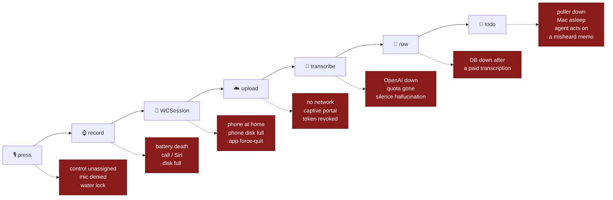
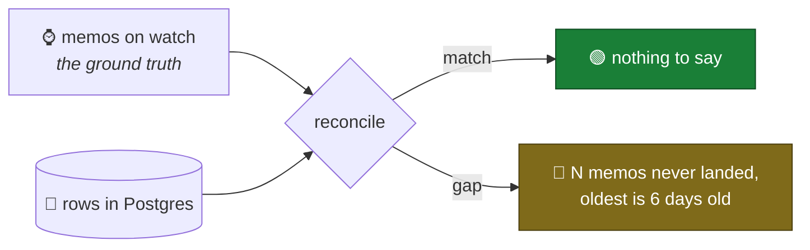

# Failure modes

**Date:** 2026-08-06
**Status:** brainstorm. Nothing here is a bug report yet — it is the catalogue
of ways a spoken thought fails to become a row in Postgres, and what the system
does about each one today.

Companion to [LIMITATIONS.md](LIMITATIONS.md), which covers what Apple *forbids*.
This covers what *breaks*.

---

## The shape of the problem

Two properties dominate everything below.

**1. Audio is never deleted while it is stuck, so almost nothing is truly
lost.** The memo is committed to watch storage before any transfer is attempted
([`MemoStore.finalize`](../../src/swift_app/WatchApp/Storage/MemoStore.swift)), and neither leg deletes its
source. Most failures are *stalls*, not losses.

Each device does eventually delete its copy — 24 h after the next hop has taken
it ([`Retention`](../../src/swift_app/Shared/Policy/Retention.swift)) — but every failure in this document
leaves the memo in a state the sweep skips, so a stall preserves the audio for
exactly as long as the stall lasts. What this property no longer covers is a
memo that moves on *successfully* and is then lost further downstream: once the
service has answered its exact `204 No Content` receipt, the audio has a day left and the transcript is the
only record.

**2. Every stall is silent.** The one-way door
([1_INGEST_ARCHITECTURE.md](../architecture/1_INGEST_ARCHITECTURE.md) §"The one-way door")
removes the return path, and with it the only place a discrepancy could have
surfaced. There is no upload UI, no reconciliation, no alert. The failure
signature for nearly every row in this document is identical: **you speak into
your wrist, and weeks later notice a thought you were sure you recorded isn't
in the database.**

That is the real risk in this design. Not loss — *undetected* loss of service.

### Legend

| Class | Meaning |
|---|---|
| 🔴 **Silent loss** | The memo, or its content, never arrives and nothing says so |
| 🟠 **Silent wrong** | Something *does* arrive, but it is incorrect — worse than nothing, because it is trusted |
| 🟡 **Stall** | Delivery is deferred, recovers on its own, invisible while it lasts |
| 🔵 **Visible** | The user or a log sees it at the time |
| 💸 **Cost** | Money, not data |

---

## Stage 0 — the press, before there is any audio

The most under-defended stage, because nothing here has a file to fall back on.
A failed press produces **nothing at all**: no memo, no log, no trace that a
thought existed.

| Failure | What happens today | Class |
|---|---|---|
| Control never assigned to the Action button | Press does whatever the previous assignment did. App is never involved | 🔴 |
| App never launched once after install | The control isn't registered, so it cannot be assigned | 🔵 |
| Mic permission undetermined on first press | Intent foregrounds the app, `startRecording` requests permission ([`RecorderModel.swift:197`](../../src/swift_app/WatchApp/Capture/RecorderModel.swift)) — a prompt appears, and **the user is already talking** | 🔴 |
| Mic permission denied | `requestPermission` returns false, `MIC OFF / ALLOW IN SETTINGS` stays on screen, no recording | 🔵 |
| Water Lock active (Ultra, swimming) | Presses are swallowed by watchOS | 🔵 |
| Theater Mode / Sleep Focus | Screen stays dark; the app foregrounds but the user gets no visual confirmation, only the haptic | 🟡 |
| Watch passcode-locked (off wrist, just put on) | Unlock required before the app can foreground; speech during that window is lost | 🔴 |
| Watch busy: on a call, in Walkie-Talkie, mid-Siri | Foregrounding competes with an audio-owning app; activation may fail → **MIC BUSY** | 🔵 |
| Storage full at press time | `store.newCaptureURL` throws → **STORAGE FULL** on screen | 🔵 |
| Double press while already recording | `startRecording` guards on `phase`/`startInFlight` and returns — the second press is a no-op, **which looks identical to a press that failed** | 🟡 |
| Cold-launch latency exceeds the user's patience | The first ~1 s of speech lands before `record()` returns. Pre-arming ([`prearm`](../../src/swift_app/WatchApp/Capture/RecordingEngine.swift)) shortens this; it cannot remove it | 🟠 |

**The clipped-first-word case deserves its own line.** It is the only failure
here that is *guaranteed on every press* rather than occasional, it is invisible
(the memo exists, it just starts mid-sentence), and it corrupts exactly the part
of a memo that carries the routing prefix — "investment idea:" becomes "vestment
idea:" and `parseRoute` files it under nothing. See the
[friction budget](LATENCY.md).

---

## Stage 1 — recording

Best-defended stage. PCM-in-CAF plus orphan recovery means a killed process
still leaves a decodable file
([`recoverOrphanedCaptures`](../../src/swift_app/WatchApp/Storage/MemoStore.swift)).

| Failure | What happens today | Class |
|---|---|---|
| Phone call arrives mid-recording | `AVAudioSession` interruption → pause, auto-resume on `.shouldResume` ([`handleInterruption`](../../src/swift_app/WatchApp/Capture/RecorderModel.swift)) — the memo has a gap but stays one file | 🟠 |
| Siri invoked mid-recording (raise-to-speak, misfire) | Same interruption path. A wrist raise while talking can silently pause the memo | 🟠 |
| Battery reaches 5% | Polled every ~5 s, auto-saves ([`checkBattery`](../../src/swift_app/WatchApp/Capture/RecorderModel.swift)) | 🔵 |
| Battery dies above 5%, or a hard shutdown | Capture survives as PCM-CAF, recovered on next launch | 🟡 |
| System kills the app (memory / thermal) | Same recovery path | 🟡 |
| Wrist drops, app backgrounds | `WKBackgroundModes: audio` keeps it running under tighter CPU limits; watchOS may still suspend | 🟠 |
| Disk fills mid-recording | `audioRecorderEncodeErrorDidOccur` → `onUnexpectedStop`; partial capture is finalized | 🔵 |
| AAC compression fails at save | Raw `.caf` is kept instead — "a large memo beats a lost one" ([`finalize`](../../src/swift_app/WatchApp/Storage/MemoStore.swift)). The phone atomically normalises it to M4A before ingest; if that fails, the CAF remains locally pending rather than being mislabelled | 🟡 |
| Recording < 0.3 s | Discarded as a stray press | 🟡 |
| User forgets to stop; memo runs for hours | AAC 32 kbit/s ≈ 240 KB/min → the 25 MB server cap is ~104 min. A raw CAF fallback is normalised on the phone before it is eligible for upload, so it cannot reach the server under a false type | 🟡 |
| Watch reboots mid-recording | Orphan recovery, as above | 🟡 |
| Microphone occluded (sleeve, rain, Ultra's siren port wet) | Silent or garbled audio. Nothing checks the level before committing | 🟠 |

**The compression fallback is now an explicit deferred conversion.** The watch
keeps the decodable CAF, the phone commits it before acknowledging the watch,
then produces an M4A atomically. The ingest client and service both require an
explicit M4A declaration, so a raw capture cannot be forwarded under a false
MIME type.

---

## Stage 2 — watch → phone (`WCSession.transferFile`)

Timing here is measured in minutes and is entirely at the system's discretion.

| Failure | What happens today | Class |
|---|---|---|
| Phone left at home / out of Bluetooth range and off WiFi | Transfer queues on the watch indefinitely. This is the first red box in [1a_UPLOAD_PATHS.md](../architecture/1a_UPLOAD_PATHS.md) | 🟡→🔴 |
| Phone battery dead for a day | Same |  🟡 |
| Companion iOS app deleted | `transferFile` has no counterpart; transfers never complete | 🔴 |
| User force-quits the iOS app from the app switcher | iOS deprioritises relaunching a user-terminated app for background delivery. Memos may sit until the app is opened manually | 🔴 |
| Watch unpaired and re-paired | `sessionDidDeactivate` → re-activate. Watch-side memos survive; whether the queue does is unverified | 🟠 |
| Watch reset / restored from backup | App container is gone. **Un-synced audio is gone with it** — the only copy | 🔴 |
| Phone storage full when the file arrives | The phone cannot commit the file/sidecar, so it sends no receipt. The watch retains its source and does not begin retention | 🟡 |
| Transfer metadata missing or malformed | The phone rejects it and never mints a replacement UUID. The watch retains the original source, so this is recoverable rather than a duplicate upload | 🟡 |
| One transfer wedges | Pending transfers are considered independently by UUID; a wedged transfer no longer blocks later memos | 🔵 |
| Airplane mode on the watch | Queued; retried on reachability change | 🟡 |
| Large backlog after a week apart | Delivered on the system's schedule, serially, over BLE — could be hours | 🟡 |

**The durable receipt closes the import-failure divergence.** A
`transferFile` completion is transport status only; the watch becomes `.synced`
only after the phone writes both audio and sidecar, then queues the original UUID
back to the watch. A failed import therefore preserves the watch source and its
retention clock never starts.

---

## Stage 3 — phone → Cloud Run

| Failure | What happens today | Class |
|---|---|---|
| No network at all | Background session `waitsForConnectivity`; the OS resumes it later | 🟡 |
| **Captive portal** (hotel, airport, café WiFi) | A portal's `200` is not WristMemo's exact `204 No Content` receipt. The phone leaves the memo pending and retries | 🟡 |
| Ingest credentials never configured | One log line, uploads disabled — the state the device build is in right now | 🔴 |
| Device rebooted, not yet unlocked | Keychain remains unavailable until first unlock, but the client installs its active observer before checking credentials and reclaims pending background work once credentials become readable | 🟡 |
| Token rotated or revoked | `401` → state `failed`, explicitly not retried. `LibraryView` renders a badge; **there is no retry affordance anywhere in the UI**, so "manual retry only" currently means "reinstall" | 🔴 |
| Memo over 25 MB | `413` → `failed`, permanent | 🔴 |
| Low Data Mode / cellular disabled for the app | Deferred until WiFi | 🟡 |
| Cloud Run scaled to zero | Cold start ~1 s, absorbed by the retry policy | 🟡 |
| Server 5xx | `pending` + backoff 30 s → 30 min | 🟡 |
| Retry backoff never fires | The retry `Task` dies with the process. Recovery depends on `didBecomeActive` or a WatchConnectivity relaunch — **and the one-way door means the user has no reason to ever open the phone app** | 🔴 |
| Endpoint URL changed (new Cloud Run revision, new domain) | DNS/TLS failure → infinite retry against a dead host | 🔴 |
| Someone else has the bearer token | They transcribe on your bill. No rate limit, no per-token quota, no alert | 💸 |
| Public endpoint gets scanned / abused | Auth rejects it cheaply, but request volume still bills Cloud Run | 💸 |

**Captive portals stay important because they delay delivery, but they no longer
produce a false success.** The exact receipt keeps the memo pending, and the
ordinary retry policy gets another chance after the user completes the portal.

---

## Stage 4 — Cloud Run → OpenAI → Postgres

| Failure | What happens today | Class |
|---|---|---|
| OpenAI down or rate-limiting | `502` → phone retries, backing off to 30 min | 🟡 |
| OpenAI credits exhausted | Same `502`, but it will *never* succeed. Retries forever, silently | 🔴 |
| Bad `OPENAI_MODEL` | Boots clean, fails on the first real memo as `502` — named in [server/README.md](../../src/server/README.md) | 🔴 |
| **Postgres unavailable after a successful transcription** | `503` → the phone retries → `isTranscribed` is still false → **the memo is transcribed and billed a second time**. The idempotency key is only written on a successful save | 💸 |
| DB unavailable before | `503`, retried cleanly | 🟡 |
| Two overlapping requests for one memo | Advisory lock → `503` + `Retry-After: 30` | 🟡 |
| Neighbouring service saturates the shared `db-f1-micro` | `503`s, and WristMemo can degrade the neighbour in the other direction | 🟠 |
| Transcript is silence | Whisper-family models hallucinate on silence ("Thank you for watching"). A confident, wrong row is stored | 🟠 |
| Proper nouns, tickers, accents mis-heard | The exact words this app exists to capture. Stored as fact | 🟠 |
| Routing prefix mis-transcribed | `parseRoute` finds nothing → the memo files under no route and never reaches the right agent | 🟠 |
| Request exceeds Cloud Run's timeout | Transcription is capped at 4 min; a long memo can outlive the platform timeout, producing a `502`-shaped stall | 🟡 |
| Secret rotated without redeploy | Old instances keep the old key until they cycle | 🟠 |
| Bad revision deployed | Every memo `500`s until rolled back. Nothing alerts | 🔴 |

**Everything from "transcript is silence" down is the 🟠 class, and the one-way
door makes it structural.** The transcript is never shown next to the audio on
any device, so a wrong transcript is indistinguishable from a right one until a
human reads the row — by which time the audio is on a watch they may have wiped.

---

## Stage 5 — transcription receipt → app-visible Codex task (wiring proof live)

The first workstation integration is live, but deliberately does not pass a
transcript or execute work. A retained-home service polls the metadata-only
watcher feed every 60 seconds and creates a normal remote Codex task whose fixed
prompt is only `Reply with exactly: hello world`. Transcript-driven todos and
execution in [2_AGENT_ARCHITECTURE.md](../architecture/2_AGENT_ARCHITECTURE.md)
remain proposals.

| Failure | What happens today | Class |
|---|---|---|
| Watcher child crashes | Its user-owned supervisor restarts it after five seconds; the retained startup dispatcher restarts the supervisor after a workstation restart | 🔵 |
| Cloud Workstation is stopped | Metadata remains in Cloud SQL and is discovered after the workstation runs again; availability is still bounded by the workstation lifecycle | 🟡 |
| Feed or app-server fails before a thread ID exists | The memo remains `pending` in the atomic ledger and retries with one-minute exponential backoff capped at fifteen minutes | 🟡 |
| Watcher stops after a thread ID exists | The record becomes `interrupted` with that app-visible thread ID. Automatic retry is refused to avoid a duplicate task | 🔵 |
| Poller silently launches a headless CLI session | Prevented: the implementation uses the documented app-server protocol, and the end-to-end check verifies the thread through the desktop app | 🔵 |
| Transcript or audio reaches the workstation | Prevented in this version: the feed returns only UUID and transcription time, and the task prompt is fixed in source | 🔵 |
| Agent hallucinates a todo from an ambiguous memo | Not yet reachable because transcripts are not passed; remains a design risk for the proposed next stage | 🟠 |
| **Execution agent acts on a mis-transcribed memo** | Not yet reachable. If execution is later built, the blast radius of stage 4's 🟠 class becomes "a wrong action in the world" | 🟠 |
| No human-review boundary in a future execution path | No execution path exists today; human approval remains mandatory before one is added | 🟠 |

The live wiring proof stops before transcript interpretation. The compounding
risk remains worth stating plainly for the proposed next stage: **execution
would turn silent-wrong into silent-wrong-and-acted-upon.** Every mitigation
for stage 4's accuracy problems gets more valuable before an execution agent
exists.

---

## Cross-cutting

**Time.** `X-Recorded-At` comes from the watch's clock. A watch that has been
off for a week and hasn't resynced backdates a memo; the server accepts any
positive unix timestamp. Ordering in the database is then wrong, and any
"what did I say today" query misses it.

**Identity.** `config.defaultUserId` is a single hardcoded user. Fine for one
person, but it means there is no way to tell two watches apart if a second one
is ever paired — both write into the same stream.

**Storage pressure on the watch.** Nothing prunes. Memos accumulate as `.m4a`
forever, and watchOS reclaims app storage under pressure by evicting the app —
which takes un-synced audio with it.

**Restore from backup.** iCloud restores `Documents/Memos`, sidecars included,
so upload state survives and re-uploads are idempotent. Restoring a *watch*,
however, does not restore un-synced captures.

**Both devices lost or stolen.** Audio exists nowhere else, by design. Every
transcript survives in Postgres; every recording does not. This is a deliberate
trade from [1_INGEST_ARCHITECTURE.md](../architecture/1_INGEST_ARCHITECTURE.md), but it is also
a failure case: there is no re-transcription against a better model, ever,
because there is no corpus to re-run.

**Privacy failures.** Not loss, but worth cataloguing next to it: an app-level
logger added later that logs the request body, a future multipart parser that
spools to disk, or a debug bucket created in the project — each quietly breaks
the "audio never rests in GCP" rule with no test guarding it.

---

## Current priority fixes

The exact ingest receipt, durable phone receipt, independent transfer queue,
raw-Capture normalisation, active-after-unlock recovery, and a phone-side Retry
action are now implemented. The remaining highest-value risks are:

1. **Double billing when Postgres fails after transcription** — write the
   idempotency key before calling OpenAI, not after.
2. **Nothing reconciles watch memos against database rows** — the single
   mitigation that would make every other entry visible.
3. **Terminal states have no alerting beyond the phone library** — exhausted
   credits and a bad model id can still live unnoticed.
4. **First-word clipping corrupts the routing prefix** — the one failure that
   happens on every press.
5. **Watch reset loses un-synced audio** — the only unreplicated copy in the
   system.

---

## What actually closes the class

Individual fixes are cheap; the pattern behind them is the point. Three
mechanisms would collapse most of this document:

1. **A reconciliation query.** The watch knows what it recorded; the database
   knows what arrived. Comparing counts is a handful of lines and detects every
   🔴 in this document without knowing which one occurred.
2. **A visible pending count.** One number on the watch face or in the app —
   "3 waiting" — converts the entire 🟡 class from invisible to obvious, and
   makes a stuck memo look different from no memos.
3. **A dead-letter path.** Anything terminal (`failed`, `413`, exhausted quota)
   should surface somewhere a human looks, rather than living in a state field
   nothing renders.

None of these break the one-way door — they carry *status*, never transcripts,
which the architecture already allows for exactly this reason.
