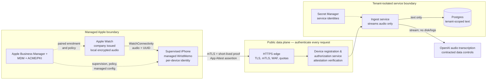

# Secure enterprise deployment

**Status:** proposed reference architecture — **not** a statement of current
production readiness.

This document describes the highest-security practical deployment of WristMemo
for an organisation that issues Apple Watches to employees. It is deliberately
stricter than a consumer deployment. It protects the thought at capture time,
limits who may send it for transcription, makes the resulting text available
only to the right tenant, and leaves an auditable trail without logging a memo.

The goal is not surveillance. MDM is used to establish a trustworthy capture
appliance and remove access when it is lost or returned. It must not be used to
collect health, fitness, ambient audio, or memo content beyond the product's
explicit capture and review policy.

## Executive decision

Use a **company-owned, one-person iPhone and Apple Watch pair**. Enrol the
iPhone through Apple Business Manager Automated Device Enrollment (ADE),
supervise it with an MDM that supports Apple Watch enrolment and Declarative
Device Management (DDM), then pair a new or reset Watch through that iPhone.

Do not build an MDM server. Use a mature Apple-focused MDM, and make WristMemo
**MDM-ready** through managed configuration and a device-bound authentication
protocol.

The current single-user implementation is not suitable for a multi-tenant or
regulated enterprise launch. It verifies short-lived Google ID tokens against
an exact user subject, protects the iOS OAuth client with App Check/App Attest,
and uses Google service-account identity for its watcher. It still lacks
managed-device registration, tenant isolation, per-device revocation and a
controlled network edge. The hardening described below is a release gate, not
an optional improvement.

## Scope and security properties

This design targets an employee using an assigned Watch and iPhone. It does
not support shared Watches, unmanaged personal iPhones, or a Watch already
paired to a personal phone.

The deployment is complete only when all of these are true:

1. Only an assigned, enrolled, compliant device pair can submit a memo for a
   tenant.
2. A stolen device loses server access quickly, and a former employee cannot
   use a retained credential on another device.
3. Audio remains encrypted on the devices and in transit; it is never written
   to GCP disk, a bucket, a request log, or an observability trace.
4. The service stores only the required transcript and minimal operational
   metadata. Tenant boundaries are enforced by the database, not merely by UI
   filtering.
5. Every privileged action is attributable to a human, service, or device
   identity without recording audio or transcript content in audit logs.
6. MDM removal, replacement, loss, and offboarding are safe, tested
   operational workflows rather than ad hoc support events.

This preserves the product boundary: the Watch records, the phone transports,
the server transcribes without persisting audio, and people—not agents—approve
consequential actions.

## What Apple Watch MDM actually requires

Apple Watch management is paired-device management. It is not a standalone,
zero-touch Watch enrolment program.

| Requirement | Secure deployment decision |
|---|---|
| Host device | Company-owned iPhone, supervised and enrolled in the organisation's MDM. Use ADE through Apple Business Manager for normal fleet deployment. |
| Watch | New or reset Watch running watchOS 10 or later. A Watch that is already paired must be unpaired/reset before managed pairing. |
| Enrolment | MDM applies the Watch-enrolment declaration to the supervised iPhone. During pairing, the user explicitly accepts Remote Management. |
| Ownership | One named employee per iPhone/Watch pair. Do not create a pooled or shift-handoff Watch workflow. |
| MDM capability | Require documented support for Apple Watch enrolment, DDM, supervised iOS devices, managed app configuration, managed app deployment, inventory, passcode/lock/erase, and an API/audit export. |
| App delivery | Apple Business Custom App or managed App Store distribution. Deploy the iPhone companion before the corresponding Watch app when the app is paired or dependent. |

After successful enrolment the Watch is supervised. The MDM can configure
settings, retrieve inventory, clear a passcode, lock, erase, and manage apps.
Apple's documented Watch enrolment flow, including the supervision and reset
requirement, is the authoritative implementation constraint:
[Deploy Apple Watch](https://support.apple.com/en-ie/guide/deployment/dep04f0c5414/web).

**Important lifecycle consequence:** unenrolling the Watch unpairs and erases
it; unenrolling the host iPhone also unenrols, unpairs, and erases its Watch.
That is desirable for lost-device containment but means replacement and
offboarding must be planned around durable delivery status.

## What real deployments teach us

Public, detailed examples of enterprise Apple Watch deployments remain rare.
The ones that are documented are useful because they show a consistent shape:
the Watch is an intentionally narrow, hands-free extension of a company iPhone
and a mature back-end workflow—not a replacement for either.

| Deployment | What the organisation did | Lesson for WristMemo |
|---|---|---|
| **Volvo Cars, Sweden** | Built the custom **Volvo Service** app for iPhone and Apple Watch. About 1,500 personal-service technicians across 180 service points receive customer-arrival notifications, checklists, real-time information from several back-end systems, and hands-free calling while servicing cars. Volvo says it first studied technicians' daily work and that Watch integration came from technician feedback. | Start with one mobile worker and one high-frequency, hands-busy moment. The Watch presents a cue or a small action; the iPhone/back end remains the system of record. Co-design with the people wearing it before scaling. |
| **Emory Hillandale Hospital** | Issued every nurse and physician an iPhone and provides Apple Watch to physicians as part of an Epic-based care environment. The Watch surfaces time-sensitive Limerick alerts, such as a critical lab result becoming ready to view. | In sensitive settings, the wrist is primarily an **attention channel**. Put the minimum safe signal on it and move rich record access, authentication, and detail to the phone or clinical system. |
| **Apple's clinical deployment guidance** | Treats a successful iPhone/Watch/iPad nursing deployment as an app-selection, integration, network, device, and accessory program—not a hardware purchase. | Plan the operational system: Wi-Fi/cellular coverage, charging, cleaning/accessory rules, support, identity, and escalation paths matter as much as the app. |

Volvo's reported improvements are directionally encouraging—its Apple case
study cites more customer follow-up, higher satisfaction for many app users,
and less printing—but they are case-study claims, not independent proof that a
Watch will improve every workflow. The transferable result is the **design
discipline**, not the percentage.

### Patterns worth copying

1. **Issue a pair, not a Watch.** Both Volvo's custom iPhone/Watch app and
   Emory's clinician setup treat the iPhone as the complementary work device.
   This aligns with Apple's paired MDM model.
2. **Keep the wrist interaction tiny.** Real deployments use arrival/critical
   alerts, checklists, status, and one-handed acknowledgement. They do not turn
   the Watch into an EHR, a desktop workflow, or a general memo library.
3. **Integrate before adding screens.** Value comes from connecting to the
   existing job/clinical workflow and routing the right event to the right
   person—not from another standalone app database.
4. **Use named ownership in high-trust deployments.** Apple's own clinical
   example assigns iPhones to individual clinicians. This gives identity,
   accountability, and a safe data boundary that shared shift devices lack.
5. **Pilot with frontline workers.** Volvo's Watch feature originated from
   technician feedback. Start with a small, instrumented cohort and measure
   interruptions, missed captures, support requests, and actual task outcome.
6. **Treat the physical lifecycle as part of security.** Apple Business Manager
   can add organisation-owned Watches at purchase and manage Activation Lock,
   but Watch MDM enrolment still happens during pairing. Asset ownership does
   not remove the need for a controlled issuance/reset/pairing process.

### What these examples do *not* solve

None of the public examples solves WristMemo's hardest enterprise problems:

- binding a transcription upload to a specific, compliant employee/device
  pair—MDM deployment is not application authorization;
- multi-tenant transcript isolation, provider-data terms, legal hold, or
  retention of spoken work content;
- reliable audio transfer when a Watch is offline, reset, or unpaired;
- a shared-Watch / shared-shift model; or
- trustworthy automation based on an imperfect transcript.

For comparison, healthcare programmes such as Ochsner's Apple Watch remote
monitoring are patient-consented, patient-data integrations. They are useful
evidence that Watch/iPhone workflows can work at scale, but they are **not** a
template for issuing and managing employee capture devices. Do not merge the
two threat models.

### Implication for WristMemo's first enterprise offer

The credible first offer is not “voice notes on every employee's Watch.” It is
“a managed capture pair for a role where hands-free thought capture has a known
cost today.” Examples could be a field technician noting a finding before the
next job, an inspector recording an observation before it is forgotten, or a
clinician dictating a non-patient operational thought outside a sterile or
patient-care workflow. The pilot must prove that capture, delivery, and later
review remove a real interruption; otherwise MDM only makes a gadget easier to
administer.

Sources: [Volvo case study](https://www.apple.com/in/business/enterprise/success-stories/manufacturing/volvo/),
[Emory case study](https://www.apple.com/ca/newsroom/2025/05/apple-products-transform-care-at-emory-healthcare/),
[Apple clinical deployment guide](https://www.apple.com/healthcare/docs/products-platform/Deploying_iPhone_for_Clinical_Communication_and_Nursing_Care.pdf),
[Apple's 2024 device-management session](https://developer.apple.com/videos/play/wwdc2024/10143/),
and [Ochsner's remote-monitoring example](https://www.apple.com/healthcare/success-stories/).

## Reference architecture

The phone is the network client. The Watch never receives an OpenAI key,
customer API key, long-lived server credential, or direct cloud route. A
background upload continues to be necessary for delivery reliability; strong
device authentication must work with it without putting a reusable fleet secret
in the app.

## Trust boundaries and required controls

| Boundary | Threat | Required control |
|---|---|---|
| Employee ↔ Watch | Lost Watch, unauthorised wearer, shoulder-surfing | Watch passcode policy inherited from the supervised iPhone; wrist detection; lock-on-removal; managed OS update baseline; explicit recorded-audio policy. |
| Watch ↔ iPhone | A different phone receives or replays an audio file | Watch-managed pairing, original watch UUID at every hop, immutable receipt state, and no replacement UUID for a recoverable transfer. |
| iPhone ↔ edge | Extracted app token, replay, a modified client, internet scanning | Per-device certificate plus short-lived, sender-constrained authorization; App Attest assertions bound to request method/path/body hash and a single-use server nonce; WAF, rate limits, body-size limits, and replay detection. |
| Edge ↔ ingest | Direct Cloud Run bypass or confused deputy | Route public traffic only through the controlled edge; restrict Cloud Run ingress to the load balancer/internal path; verify any edge-to-service identity before accepting tenant claims. |
| Ingest ↔ OpenAI | Key theft, unintended persistence, sending to a wrong endpoint | OpenAI key only in Secret Manager, outbound allowlist/egress control, fixed transcription endpoint, dedicated production project, and an approved data-processing posture. |
| Ingest ↔ database | Cross-tenant read/write, schema takeover, excessive retention | Separate runtime and migration identities, tenant-enforcing queries/RLS, least-privilege roles, encrypted backups, and a retention/deletion policy. |
| Transcript ↔ people/agents | Wrong person reads text or an agent acts on a bad transcript | Identity-based review access, audit logs, correction workflow, human approval for consequential actions, and no transcript sent to the Watch by default. |

## Device-management configuration

### Company ownership and enrolment

1. Register the organisation with Apple Business Manager and connect the
   selected MDM.
2. Purchase iPhones and Watches through Apple or a participating reseller so
   they appear in Apple Business Manager. Assign the host iPhone to the MDM and
   enrol it through ADE. The Watch's organisation asset record and Activation
   Lock controls do not create an independent Watch ADE flow; managed Watch
   enrolment still occurs during pairing.
3. Require iPhone supervision, a non-removable MDM profile, a device passcode,
   current supported OS version, encrypted backups policy, and prompt security
   updates. Do not allow a Watch to be paired to an iPhone that fails
   compliance.
4. Apply the MDM Watch-enrolment configuration to the eligible iPhone group.
   Pair only a new/reset company Watch; record the iPhone/Watch relationship in
   both MDM inventory and WristMemo's device registry.
5. Verify the Watch is supervised, its compliance record is attached to the
   host phone, and WristMemo is installed before issuing the pair.

ADE is the normal organisation-owned model because it can supervise a device
at setup and prevent a user from removing MDM. See Apple's
[Automated Device Enrollment guidance](https://support.apple.com/guide/deployment/automated-device-enrollment-management-dep73069dd57/1/web/1.0).

### Minimum policy baseline

Apply the narrowest policy that protects the enterprise use case without
turning the Watch into a hostile appliance.

- Require a device passcode, reasonable auto-lock, and an up-to-date OS on the
  supervised iPhone; validate the paired Watch's passcode and OS in MDM.
- Allow only required apps. Use the Watch restrictions to prevent user app
  removal and, when appropriate, prevent App Store installs; MDM can still
  deploy approved apps. [Apple's Watch restriction list](https://support.apple.com/en-euro/guide/deployment/dep34c5cd30f/web)
  describes the supported controls.
- Provide enterprise Wi-Fi, certificate, and VPN configuration only where they
  improve upload reliability or protect a corporate network. Do not require a
  VPN before local recording; capture must remain offline-first.
- Do not force ambient capture, background speech recognition, location
  collection, health-data export, or additional capture-time screens. These
  violate the product's privacy and friction boundaries.
- Restrict profile/account changes only when legal and HR policy authorise it.
  Make the employee-facing privacy notice clear about what is managed and what
  data is not collected.

Health and fitness information is not sent to the MDM server in Apple's Watch
management model. Treat that as an explicit non-collection commitment, not as
a reason to infer or export it through WristMemo.

### Managed app configuration, never app-embedded secrets

MDM should install only non-secret bootstrap values: tenant slug, API base URL,
device-registration URL, required app version, feature policy, and a key/cert
reference. It must never distribute an OpenAI API key or a long-lived shared
ingest bearer token.

On current iOS, Apple's ManagedApp framework can provide managed apps with
per-app configuration, identities, certificates, and secrets; it also supports
hardware-bound keys and managed-device attestation. Use it when the selected
MDM and OS baseline support it. [Apple's managed-app deployment guidance](https://support.apple.com/en-ca/guide/deployment/dep575bfed86/web)
is the source of truth for availability.

## Device identity and API authentication

### Extend current Google auth with managed-device identity

The current app obtains short-lived Google ID tokens through Google Sign-In;
the server verifies the exact OAuth audience and immutable user subject. OAuth
App Check/App Attest protects token issuance from modified iOS clients. This is
appropriate for the private single-user deployment, but it cannot establish
the assigned enterprise tenant, current MDM compliance, or a server-revocable
individual device record.

Use this registration flow instead:

1. MDM installs a signed bootstrap configuration containing only the tenant,
   registration endpoint, and device policy ID.
2. The managed iPhone authenticates to the registration service with a
   hardware-bound client certificate issued through the organisation's ACME
   service. Where supported, the CA verifies Apple Managed Device Attestation
   and matches the attested serial/UDID to MDM inventory.
3. The WristMemo iPhone app creates and attests an App Attest key. The service
   verifies the Apple attestation once and stores the app public key against the
   assigned device record. App Attest proves a legitimate app instance; it does
   not replace MDM compliance or user authorization.
4. The service returns a short-lived, tenant-scoped upload authorization bound
   to both the client certificate and the app key. Its claims include a
   pseudonymous device ID, tenant ID, allowed endpoint, expiry, and key ID—no
   memo content.
5. For each upload, the phone presents mTLS and an App Attest assertion over a
   server nonce plus the request's method, path, timestamp, body hash, and
   credential ID. The server consumes the nonce and checks the assertion
   counter before it reads the audio stream.
6. Certificate revocation, expired authorization, failed compliance, MDM
   unenrolment, or a lost-device event denies new uploads immediately. Cached
   audio remains protected locally until the approved loss/offboarding policy
   decides whether to erase it.

Apple documents App Attest's challenge-and-assertion flow for proving that a
request came from a legitimate app instance in
[Establishing your app's integrity](https://developer.apple.com/documentation/DeviceCheck/establishing-your-app-s-integrity).
For the iPhone's managed-device identity, use ACME attestation—not an asserted
UDID from the app—as the hardware-backed evidence. Apple's
[Managed Device Attestation deployment guide](https://support.apple.com/guide/deployment/deploy-managed-device-attestation-dep54e5ac1fd/web)
explains this model. Apple Watch itself does not add Managed Device Attestation
hardware support, which is why the phone is the network trust anchor.

### Key and credential rules

- Store only device-bound private material in the Keychain; use a
  `ThisDeviceOnly` accessibility class where the background-upload requirement
  permits it. Do not make a credential iCloud-migratable.
- Make access authorizations short-lived (hours, not weeks), rotate client
  certificates on a fixed schedule, and revoke them on loss/offboarding.
- Keep production, staging, and test tenants, CAs, MDM groups, OpenAI projects,
  and secrets completely separate.
- Reject requests whose tenant/device pair is inactive, whose Watch/phone
  pairing is no longer current, or whose signing/assertion data is replayed.
- Never use IP address or device serial number alone as authorization.

## Data protection and minimisation

### Audio on the devices

Audio is the ground truth, so it must survive ordinary connectivity failure.
It is also highly sensitive. Protect it using the operating system's Data
Protection class and an enforced passcode, and keep it in the app container
only. Do not write it to Photos, Files, shared app groups, crash reports,
analytics, or support bundles.

The current phone memo directory is eligible for iCloud restore. Before an
enterprise release, choose and document exactly one policy:

- **Recommended high-security policy:** mark memo audio and sidecars excluded
  from all backups. This minimises copies but accepts that audio not yet
  transcribed is unrecoverable if both assigned devices are wiped or lost.
- **Recovery-required policy:** encrypt every memo in the app before it is
  backup-eligible, using a per-tenant envelope key with a documented escrow,
  rotation, deletion, and lawful-access process. Do not rely on a personal
  Apple Account's backup as an undeclared enterprise archive.

Either policy requires a test that proves audio cannot escape the intended
storage locations. Neither changes the rule that the Watch and phone delete
only after a verified next-hop receipt.

### Audio in services and providers

The existing raw-body streaming architecture is the correct starting point:
the service forwards bytes to transcription and never creates an audio object
in GCP. Retain these invariants:

- No multipart parser, object storage, temp-file upload, request-body logging,
  tracing payload capture, packet capture, or error reporter attachment.
- Log only event type, pseudonymous tenant/device ID, memo UUID, byte count,
  status, latency, and a correlation ID. Do not log the audio filename if it
  contains employee information, transcript, route, exception body, HTTP
  Authorization header, or managed configuration value.
- Add automated CI and production checks that fail if a bucket is introduced,
  body logging is enabled, an upload is buffered to disk, or a source logger
  can include request/response bodies.
- Encrypt transcript storage and backups, scope read access by tenant and role,
  and set an explicit deletion schedule. Search indexes, embeddings, analytics
  exports, and incident tickets are additional stores that need the same
  retention rules.

For the OpenAI `/v1/audio/transcriptions` endpoint, the current official data
controls table lists no abuse-monitoring retention and no application-state
retention, and the API data is not used for training unless an organisation
opts in. Still obtain the customer's required agreement, data-residency
setting, and retention approval before launch; policies and eligibility can
change. See [OpenAI API data controls](https://developers.openai.com/api/docs/guides/your-data#default-usage-policies-by-endpoint).

## Cloud and database hardening

### Network edge

The service must remain internet-reachable because background uploads have no
human Google identity, but the Cloud Run URL must not be its public front door.

1. Put a managed HTTPS edge in front of the service.
2. Configure Cloud Run to accept ingress only from the load-balancer/internal
   path, so its direct external URL cannot bypass the edge. Confirm the
   selected edge's Cloud Run invocation model: some load-balancer paths still
   need platform-level unauthenticated invocation, in which case restricted
   ingress and the application/device gates remain mandatory.
3. Use an mTLS-capable edge or gateway to validate the device client
   certificate, then apply WAF rules, per-device/tenant quotas, request-size
   and upload-duration limits, and DDoS protection.
4. Pass tenant/device claims only after the edge has verified them. The ingest
   service must reject client-supplied headers that claim a tenant and must
   verify the edge-to-service identity supported by the selected platform.
5. Restrict service egress to the database, secret provider, telemetry endpoint
   and transcription provider; keep an explicit change process for provider IP
   or hostname changes.

The current public Cloud Run service protected by application-level Google
identity checks does not by itself meet this enterprise edge requirement.

### Runtime, supply chain, and secrets

- Use a dedicated GCP project (or a strongly isolated customer environment when
  contractually required), regional resources, and a separate production
  billing boundary.
- Run the ingest service with a dedicated service account. Grant only Cloud SQL
  connect/auth and the precise Secret Manager versions it needs. The existing
  separate migrator and ingest identities are a pattern to retain.
- Build in CI, run unit/integration/security tests, generate provenance, scan
  dependencies and images, sign the image, and deploy only an immutable digest.
  Require reviewed Terraform plans and separate production approval.
- Store OpenAI credentials, certificate issuer credentials, token-signing keys,
  and edge secrets in Secret Manager/HSM-backed KMS; never in source, Xcode
  schemes, MDM profiles, Terraform state, CI logs, or crash reports.
- Rotate secrets through overlapping versions. Exercise revocation and rollback
  quarterly; an untested rotation procedure is not a security control.
- Disable debug endpoints in production or make them workload-identity-only.
  Health checks expose no tenant or service detail.

### Tenant-isolated text store

The database schema must add an immutable `tenant_id` and a device/employee
ownership model. Derive both from verified server-side authorization—not the
memo request body or MDM configuration. Enforce them in every query with
database row-level security or separate databases per tenant, depending on the
customer's isolation requirement.

The runtime role needs only the smallest permissions required to create and
read its own tenant's memo rows. It must not own the schema, change migrations,
read other tenants, or grant roles. A review/retrieval service and a future
agent service use different, narrower roles. Never let a model runtime inherit
bulk transcript export permission.

## Operational lifecycle

### Issue and activation

1. Inventory both devices in Apple Business Manager and MDM/the asset system
   before handoff; assign the pair to one employee and one tenant.
2. Enrol the iPhone with ADE, apply the Watch-enrolment profile, pair the reset
   Watch, and record the device relationship.
3. Deploy WristMemo and its non-secret managed configuration. Complete
   per-device registration and attest it before enabling real uploads.
4. Verify passcode, app version, compliance posture, certificate, revocation
   path, and a status-only end-to-end memo receipt. Use synthetic test audio;
   do not ask staff to speak sensitive information for commissioning.
5. Give the employee a plain-language notice explaining recording intent,
   storage, transcription provider, retention, MDM visibility, and lost-device
   handling.

### Loss, incident, replacement, and offboarding

| Event | Immediate action | Data decision |
|---|---|---|
| Suspected theft | Disable device record, revoke certificate/authorizations, preserve audit evidence, then MDM-lock/erase the iPhone and Watch per incident policy. | Confidentiality wins; do not delay wipe merely to recover an unsynced memo. |
| Normal replacement | Confirm status-only receipts and successful reassignment before unenrolling the old pair. | Do not delete the last audio copy before a verified next-hop receipt. |
| Employee departure | Revoke server identity first, preserve only records required by policy, then unassign/unpair/erase through MDM and Apple Business Manager. | Make retention/deletion decisions under the tenant's documented policy, not an administrator's judgment call. |
| MDM or app compromise | Suspend the affected MDM group and device certificates, rotate the affected issuer/application secrets, block new upload, investigate with metadata-only logs. | Avoid exporting transcripts or audio into incident tickets by default. |

Offboarding must be rehearsed. Apple Watch unenrolment resets the Watch; an
unrehearsed command can otherwise become accidental evidence destruction.

## Monitoring, audit, and evidence

Security observability must be content-free. Record and alert on:

- device registration, compliance transition, certificate issuance/revocation,
  MDM enrolment/unenrolment, app version, and iPhone/Watch reassignment;
- rejected authorization, failed assertion/nonce reuse, rate-limit hits, unusual
  byte counts, failed transcripts, retry age, and terminal delivery state;
- role grant changes, secret reads/versions, production configuration changes,
  image digest deployments, database migration checksum results, and break-glass
  access;
- retention jobs and reconciliation gaps, expressed as counts and memo UUIDs
  only—not titles, routes, transcripts, or audio.

Maintain a time-bounded, access-controlled audit log with documented retention.
Alert a human when a device is still holding a pending memo beyond the chosen
threshold, but send status only. This improves reliability without reopening a
content channel to the wrist.

## Release gates and validation

No enterprise pilot starts until each row is demonstrably green.

| Gate | Evidence |
|---|---|
| Managed pair | A new/reset Watch enrols through a supervised ADE iPhone; existing Watch reset, rejection, and replacement flows are tested. |
| Device policy | MDM inventory shows the expected iPhone/Watch pair, passcode, OS baseline, app version, restrictions, and unenrolment behaviour. |
| Per-device auth | A captured request, copied credential, replayed assertion, expired certificate, unenrolled iPhone, and reassigned Watch are all rejected. |
| Tenant isolation | Automated tests prove a service role and API request cannot read or write another tenant's text, even with an altered header or UUID. |
| No audio at rest in GCP | Tests and log review prove no audio body is stored in Cloud Run, Cloud Logging, traces, error reporting, buckets, images, temp files, or database columns. |
| Provider controls | The exact transcription endpoint, OpenAI project, retention/data-residency setting, contract, and approved model are captured in the change record. |
| Loss/offboarding | Certificate revocation, device lock/erase, MDM unenrolment, tenant deletion, and normal replacement are rehearsed with synthetic audio. |
| Capture reliability | Security controls do not delay first sample or block offline recording; recovery, receipts, retention, and reconciliation tests continue to pass. |
| Review safety | No agent can take an external action from a transcript without a human approval record. |

## Phased implementation

### Phase 0 — choose and prove the device platform

Select an MDM that can demonstrate Apple Watch DDM enrolment against the
organisation's exact iPhone model, Watch model, OS baseline, and Apple Business
Manager tenant. Run a two-pair lab pilot using dummy tenant configuration and
synthetic audio only.

### Phase 1 — make the app enterprise-safe

Implement managed configuration, the device registry, tenant model, ACME/mTLS
device identity, per-request App Attest assertion verification, short-lived
device authorization, replay protection, backup policy, content-free telemetry,
and status-only reconciliation. Replace the single-user subject allowlist with
tenant- and device-specific authorization.

### Phase 2 — harden the service boundary

Move the public path to the controlled HTTPS edge; restrict Cloud Run ingress;
implement WAF/quota/egress controls; add RLS or separate tenant databases;
establish production key rotation, security monitoring, and an incident runbook.

### Phase 3 — constrained employee pilot

Issue a small number of pairs to informed users. Measure capture latency,
delivery reliability, certificate renewal, loss/return workflow, support load,
and policy clarity. Do not broaden the fleet until every release gate is
repeatable.

## Decisions that must be made before contracting

The customer—not the app—must make these choices in writing:

1. Is the deployment company-issued only, or are personal devices in scope?
   The high-security design supports company-issued pairs only.
2. What data classification applies to audio, transcript, metadata, and derived
   research? Which retention, legal hold, discovery, and deletion rules apply?
3. Is data residency required? If so, which regions and providers are permitted
   to process audio and retain transcript text?
4. Is untranscribed audio excluded from backup, or encrypted/escrowed for
   recovery? Who can authorize recovery?
5. What is the loss/offboarding authority and time-to-revoke target? Who can
   issue an erase, and how is that action reviewed afterward?
6. Which roles may search or export transcripts? What is the human-approval
   boundary for any downstream automation?

Until those answers, an MDM deployment can be technically impressive but not
secure in the way an enterprise customer actually needs.

## Primary references

- Apple: [Deploy Apple Watch](https://support.apple.com/en-ie/guide/deployment/dep04f0c5414/web)
- Apple: [Managed Device Attestation](https://support.apple.com/guide/deployment/deploy-managed-device-attestation-dep54e5ac1fd/web)
- Apple: [Managed app distribution and configuration](https://support.apple.com/en-ca/guide/deployment/dep575bfed86/web)
- Apple: [App Attest](https://developer.apple.com/documentation/DeviceCheck/establishing-your-app-s-integrity)
- OpenAI: [API data controls](https://developers.openai.com/api/docs/guides/your-data#default-usage-policies-by-endpoint)
- WristMemo: [Capture-to-transcript architecture](../architecture/1_INGEST_ARCHITECTURE.md), [upload path](../architecture/1a_UPLOAD_PATHS.md), [failure modes](FAILURE_MODES.md), and [capture appliance](../product/CAPTURE_APPLIANCE.md)
