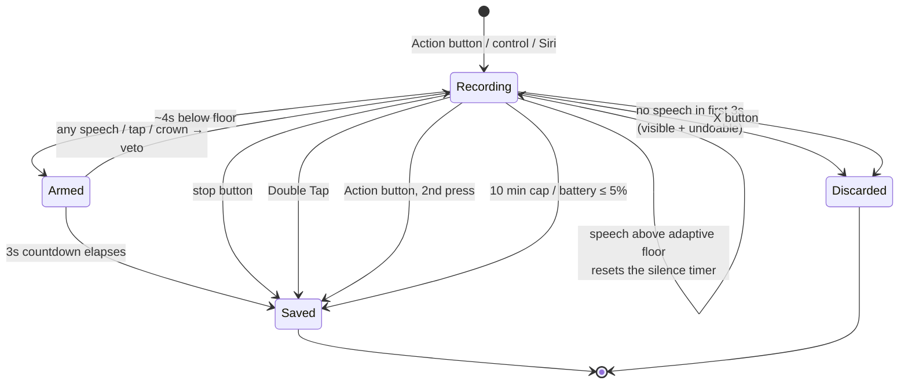

# Ending a Recording — Friction Brainstorm

**Status:** brainstorm, pre-implementation
**Date:** 2026-08-06
**Companion to:** [`trigger-mechanisms.md`](trigger-mechanisms.md), which covers the
other end of the same problem.

Same tagging convention as the trigger memo: **[verified]** against Apple docs,
this repo's source, or shipping apps; **[inferred]** where it needs on-device
confirmation. Don't build on an `[inferred]` line without testing it.

---

## 1. Where we actually are today

**[verified — read from source]**

| Path | Where | Status |
|---|---|---|
| Tap the red stop button | `WatchApp/Views/RecordingView.swift:50` | Shipping |
| Tap the X to discard | `RecordingView.swift:46` | Shipping |
| Battery ≤ 5% → auto-save | `RecorderModel.checkBattery()` | Shipping |
| Media services reset / encoder death → salvage | `RecorderModel`, `RecordingEngine` delegate | Shipping |
| Phone call ends and mic can't be reclaimed → save | `handleInterruption(.ended)` | Shipping |
| `WristMemoAutoStopAfter` timed stop | `DebugOptions` | DEBUG only, test harness |
| **Double Tap** | — | **Not implemented.** `grep handGestureShortcut` → zero hits |
| **Action button second press** | — | **Not implemented.** `StartRecordingControl` fires `StartRecordingIntent`, which only starts |

So the honest summary: **there is exactly one deliberate way to stop a recording,
and it requires looking at the watch and hitting a 58-point circle with your other
hand.** Every other stop path in the codebase is a failure-recovery path.

That's a strange asymmetry given how much of this project went into making
*starting* zero-friction — pre-armed recorders, session activation before SwiftUI
builds a frame, a haptic fired before the mic is even confirmed open. All of that
effort gets spent, and then the user has to stop and look at their wrist anyway.

> **Update, 2026-08-06 — items 1, 2 and 4 of §6 are now built.** Double Tap
> targets the stop button, silence ends a recording through the arm-warn-veto
> flow in `SilenceMonitor`, and a 10-minute cap backstops both. The rows above
> describe the state this memo was written against; §6 tracks what landed. The
> Action button toggle is still open, and still blocked on the same measurement.

---

## 2. The asymmetry that decides everything

Starting and stopping are not mirror images.

|  | Starting | Stopping |
|---|---|---|
| User state | Deliberate, hand free, intent formed | Mid-thought, hands possibly busy, trailing off |
| Cost of a false negative (didn't fire) | You press again. Annoying. | Recording runs on. Battery, and it keeps capturing the room. |
| Cost of a false positive (fired when it shouldn't) | A junk 2-second memo | **The tail of your thought is gone** |
| Recoverable? | Yes, trivially | **The false positive is not** |

**The design rule that falls out of this: a stop mechanism must be biased toward
staying on.** Whenever the choice is "risk cutting them off" vs. "risk running a
few seconds long," run long. Five wasted seconds of audio costs nothing; the last
clause of a thesis is the whole reason the memo exists.

This single constraint is what makes naive silence-detection dangerous, and it's
what shapes the recommendation in §6.

### The second-order fix

A premature stop stops being unrecoverable if **stopping immediately re-arms and
the next press appends** — the "continue last memo" idea already sitting in
`IDEAS.md:174`. Press within ~60s of a stop and it extends the previous memo
instead of creating a new one.

That changes the risk calculus completely. With append, auto-stop can be tuned
aggressively; without it, auto-stop has to be timid. **Ship append and auto-stop
together, or ship auto-stop timid.**

---

## 3. How to score a stop mechanism

Friction isn't one number. Five axes, and the mechanisms trade off differently
along them:

1. **Attention** — do you have to *look*?
2. **Hands** — do you need the other hand free?
3. **Precision** — do you have to hit a target?
4. **Availability** — which watches, and is the surface on screen right now?
5. **Failure mode** — when it goes wrong, which direction does it go?

Plus a sixth that gets forgotten: **latency to certainty.** The interaction is not
over when the recording stops. It's over when the user *knows* it stopped and
*knows* it saved. See §7.

---

## 4. The mechanisms

### 4.1 Tap the stop button — shipping

The floor. Works on every watch, every time, no chip gate, no gesture model, no
threshold to tune.

**Cost:** all three of attention, hands, and precision. The worst score on the
board — and it's the only one we have.

**Keep it forever.** Every other mechanism here is probabilistic in some way.
This one isn't, and it's the thing you reach for when the clever path failed.
Never remove it, never hide it behind a scroll, never make it smaller.

---

### 4.2 Double Tap — S9 and later, ~5 lines, biggest win on this page

Pinch index finger and thumb twice. `.handGestureShortcut(.primaryAction)`.
**[verified via `trigger-mechanisms.md` §3.2 — watchOS 11+, SwiftUI only]**

This is the mechanism this app was *designed* for and never got. `IDEAS.md:15`
already argues it: Double Tap is weak as a start trigger because something has to
put a surface on screen first, but as a stop trigger the precondition is already
satisfied — **we're recording, so our screen is already frontmost.**

```
raise wrist → pinch pinch → stopped
```

No target to hit, no second hand, works with gloves, wet hands, while holding
something. The one gesture that beats it is not looking at all (§4.4).

**Implementation, on today's code:**

```swift
CircleButton(systemImage: "stop.fill", ...) {
    Task { await model.stopAndSave() }
}
.handGestureShortcut(.primaryAction, isEnabled: model.phase == .recording)
```

**Four things that will bite:**

1. **Only one element app-wide** can hold `.primaryAction` at a time. Convenient
   here: `HomeView`'s record button and `RecordingView`'s stop button are never on
   screen simultaneously, so the phase check makes them naturally exclusive.
2. **It must target Stop, never Discard.** The X button sits next to it in the
   same HStack. A gesture that occasionally deletes the memo is worse than no
   gesture at all.
3. **Must be above the fold** — if it scrolls out of view, double tap *scrolls
   toward it* instead of firing. The recording screen is short enough today, but
   anything added to it (chapter markers, level history) has to go *below* the
   controls.
4. **The system draws the outline.** Can't suppress it. Design the stop button
   expecting a highlight ring around it.

**The real hole: Return to Clock.** **[inferred — measure this]** The watch
returns to the clock roughly two minutes after last interaction. For a four-minute
memo, a wrist raise at minute three shows the *clock*, not our stop button — and
double tap there opens the Smart Stack instead. So double-tap-to-stop is reliable
for short memos and unreliable for exactly the long ones where a stop gesture
matters most.

Two mitigations, both worth doing:
- Ask for **Settings → Return to App** during onboarding (user setting, can't be
  forced).
- Ship a **Smart Stack widget that shows elapsed time and holds the primary
  action**, so after return-to-clock the double tap still has something to hit.
  Just Press Record does this, per `trigger-mechanisms.md` §3.3.

---

### 4.3 Second press of the Action button — Ultra only, correct semantics

**[verified — this is what every Apple Action button assignment does]** Workout,
Stopwatch, Waypoint, Backtrack, Dive, Flashlight: all toggle a session. None
navigate. `trigger-mechanisms.md` §3.1 already calls this out and `IDEAS.md:61`
asks for it.

Zero attention, zero precision, no second hand needed if you press it against
your body. The best interaction on the page — for the ~10% of watches that have
the button.

**The catch, and it's real.** `StartRecordingControl.swift:9` documents the
current choice explicitly:

> A button models "start a new memo" exactly, and stopping happens in the app
> where the recording actually lives.

That reasoning is about the *control's appearance* — a `ControlWidgetToggle`
would need the extension to report recording state, and the extension can't
observe the app's audio session. That constraint is real and stands.

But it doesn't block a toggle *behavior*. Keep `ControlWidgetButton` and its
static "Record Memo" label; change what the intent does. `StartRecordingIntent`
becomes `ToggleRecordingIntent`: it foregrounds the app, and the app — which
knows its own phase — either starts or stops. The widget never has to know.

**Open question, and it's `trigger-mechanisms.md` #3 restated:** when the app is
already frontmost and recording, does a second Action button press deliver the
intent to the live `RecorderModel.shared`, or does it run a fresh intent
execution that can't see the running recording? This decides whether the toggle is
five lines or a whole shared-state dance through the App Group. **Measure before
designing.**

---

### 4.4 Silence auto-stop — the "do nothing" path

The user's framing: *no speech for ~10 seconds and it stops.* This is the only
mechanism with a friction score of literally zero, and it deserves the most
careful design on this page.

#### 4.4.1 We already have the signal

**[verified]** `RecordingEngine.currentLevel()` returns a normalised 0…1 level
from `averagePower(forChannel:)`, floored at −50 dBFS, and `RecorderModel.tick()`
already polls it at 10 Hz. A naive implementation is counting consecutive
below-threshold ticks — call it fifteen lines in `RecorderModel`, no new
frameworks, no new permissions, no battery cost beyond what's already spent.

That cheapness is a trap. The naive version works beautifully in a quiet office
and fails everywhere else.

#### 4.4.2 Level is not speech

| Environment | What a fixed threshold does |
|---|---|
| Quiet room | Works |
| Café, car, train, street | Ambient sits above the floor → **never stops** |
| Wind on the wrist | Same, worse |
| Soft speech, wrist rotated away from the mouth | Sits near the floor → **stops mid-sentence** |

That last row is the one to fear, and note it's the posture this app is actually
used in — `trigger-mechanisms.md` open question #6 flags wrist-away mic quality as
unmeasured.

**Fix: adaptive, not fixed.** Track a rolling noise floor over the first ~2
seconds and the quietest recent window, then require speech to sit N dB *above
that floor*. The cafe's ambient becomes the baseline instead of a false positive.

> **An adaptive floor alone is not enough — found while implementing this.**
> There is one case it cannot handle, and it's the *most common* way this app is
> used: press the Action button and start talking immediately. With no leading
> silence, the floor seeds itself from the speaker's own voice, the relative test
> can never fire, and the memo stops seven seconds into the first sentence.
>
> No amount of tuning fixes it, because at t=0 there is genuinely no information
> that separates "loud room" from "person talking". `SilenceMonitor` therefore
> tests **relative OR absolute**: speech is anything above the learned floor plus
> a margin, *or* above an absolute level that room tone rarely reaches. A room
> louder than that absolute level simply never auto-stops, which is the safe
> direction to fail. That constant is the one number here that genuinely needs
> calibrating on device — see §8, item 1.

Two cheap refinements while we're in there:
- Use **peak** power alongside average — peak responds to speech onsets that
  average smooths away.
- Require a **minimum voiced duration** before arming the countdown, so a door
  slam doesn't reset the silence timer and keep a finished memo running.

**Heavier options, both [inferred — verify availability and cost on watchOS 26]:**
`SoundAnalysis` (`SNClassifySoundRequest`) has a speech classifier, and `Speech`
gives real VAD. Both are far more accurate and far more expensive on a wrist. Not
for v1 — the adaptive level threshold is probably good enough, and it's free.

#### 4.4.3 Ten seconds is simultaneously too long and too short

There are two different silences and one threshold can't serve both:

| Silence | Meaning | Right response |
|---|---|---|
| 2–4s trailing off at the end | "I'm done" | Stop |
| 5–20s mid-memo pause | Thinking, interrupted, listening to someone else | **Keep recording** |

A single 10s threshold splits the difference badly: it leaves 10 seconds of dead
air on every memo *and* still cuts off anyone who pauses to think for 11.

#### 4.4.4 The recommended shape: arm, warn, veto

Don't stop on silence. **Announce** on silence.

```
~4s below the adaptive floor
   → haptic + on-screen "Stopping…" with a 3-second countdown
   → any sound above the floor, any tap, any crown turn → cancel, back to recording
   → countdown elapses → stop and save
```

This converts the dangerous failure from *silently truncated* into *nudged, and
you could veto it*. The haptic matters more than the visual — the whole point is
the user isn't looking.

It also fixes the two-silences problem without a second threshold. A thinking
pause gets a buzz at 4s; you either keep talking (cancelled, cost = one buzz) or
you were actually done (stopped at 7s instead of 10). Total dead air on a normal
memo drops from ten seconds to about four.

Note the countdown must not be cancellable by *ambient* noise, or it never fires
in a café — the veto threshold has to be the same adaptive speech threshold, not
raw level.

**Defaults:** on by default, adjustable (Off / 4s / 8s / 15s). It should be the
*normal* way memos end; the button, gesture, and Action button are for
interrupting early.

#### 4.4.5 Silence at the *start* is a different feature

**[from `IDEAS.md:163`]** An accidental Action button press against a desk creates
a zero-word memo. If nothing exceeds the noise floor in the first ~3 seconds,
**discard** — don't save.

Different threshold, different action, and it needs a hard rule attached:

> **Auto-stop may silently save. Auto-discard must be visible and undoable.**

Silently deleting a user's audio is an unrecoverable trust failure in an app whose
entire premise is "your thoughts are safe here." Show it in the UI, keep it
undoable for the session, and never apply it once any speech was detected.

#### 4.4.6 Hard duration cap

Not friction, but the backstop that makes everything else safe. There's already a
battery-critical save at 5%; add a wall-clock cap (10 min?) with a haptic warning
one minute out. Prevents the all-day pocket recording that a failed silence
detector would otherwise produce — which is the privacy failure, not just the
battery one.

---

### 4.5 Ruled out, with reasons

| Mechanism | Verdict |
|---|---|
| **Wrist down** | **Never.** This is precisely when the user wants recording to *continue* — the entire `WKBackgroundModes: audio` story exists for it. Would break the core use case. |
| **Palm over screen** | The watchOS mute gesture. System-only, not exposed to apps. **[verified — `trigger-mechanisms.md` §3.5]** |
| **Shake to stop** | `CMMotionManager` is available **[inferred on watchOS 26]**, but walking, running, and a rough road all shake. Repurpose it as *discard the memo you just made* instead, where a confirmation step is acceptable. |
| **Crown press** | Goes home; recording continues by design. Not a stop. |
| **Side button** | Reserved — Control Center, Apple Pay, SOS. |
| **AirPods stem** | Reserved for playback transport; nothing is playing. |
| **Clench / double-clench / wrist flick** | AssistiveTouch and system-only. Double Tap is the only gesture exposed to apps. |
| **Spoken stop word ("end memo")** | Needs continuous on-device recognition — battery-hostile, and false-triggers when you say the phrase in context. Better done *server-side*: transcribe, detect a trailing "end memo," trim it. Doesn't stop the recording, but it cleans the tail. |

---

## 5. Scorecard

| Mechanism | Attention | Hands | Precision | Watches | Fails toward | Build cost |
|---|---|---|---|---|---|---|
| Stop button | Look | Two | High | All | Nothing — deterministic | Shipping |
| Double Tap | **None** | **One** | **None** | S9+ | Doesn't fire (safe) | **~5 lines** |
| Action button ×2 | **None** | **One** | **None** | Ultra only | Doesn't fire (safe) | Small–unknown (§4.3) |
| Silence auto-stop | **None** | **None** | **None** | All | **Both directions** — needs §4.4.4 | Medium |
| Duration cap | None | None | None | All | Runs long (safe) | Trivial |
| Start-silence discard | None | None | None | All | **Deletes audio** — needs undo | Small |

---

## 6. Recommendation

Ship all of them, layered — the same "one intent, several thin adapters" shape the
start path already uses. No single stop mechanism is a point of failure.



**Order to build, by value per line of code:**

1. ✅ **Double Tap on the stop button** — five lines, removes attention and
   precision from the interaction for every S9+ watch. Nothing else on this page
   has that ratio. *Done: `RecordingView.controls`, with the record button
   claiming `.primaryAction` while idle.*
2. ✅ **Duration cap + warning haptic** — trivial, and it's the safety net that
   lets everything below be tuned less timidly. *Done: 10 minutes, warning at
   nine, in `RecorderModel.enforceDurationCap()`.*
3. ⏸ **Action button toggle** — measure the intent-delivery question first
   (§4.3), then decide if it's five lines or fifty. *Blocked on device access.*
4. ✅ **Silence auto-stop, arm-warn-veto shape** — the real work. Adaptive floor,
   not fixed dB. This is the one that makes the app feel like it's reading your
   mind. *Done: `SilenceMonitor`, 4s to arm, 3s to veto, on by default with a
   toggle in `HomeView`. Thresholds are unvalidated against a real microphone —
   see §8.*
5. ⏳ **Start-silence auto-discard** — only after the auto-stop threshold logic is
   proven, and only with visible undo. *Deliberately not built: it deletes audio,
   and §8 item 1 is still unmeasured.*
6. ⏳ **Smart Stack widget with elapsed + stop** — closes the Return to Clock hole
   for long memos, and is the universal-availability stop surface for watches with
   neither Double Tap nor an Action button.

**Append / "continue last memo" (§2) is the force multiplier.** Build it and every
auto-stop threshold can be aggressive, because being wrong costs one press instead
of one thought.

---

## 7. The part that gets forgotten: knowing it stopped

With every mechanism above except the stop button, **the user isn't looking at the
watch.** The haptic isn't a nicety at that point — it's the entire feedback
channel, and it has to answer two questions distinctly: *did it stop*, and *did it
save*.

`Haptics` already separates these — `.stop` then `.success` **[verified,
`WatchApp/Haptics.swift`]** — which is right, and matters much more once stopping
is invisible. Worth pushing further:

- **Auto-stop should feel different from a deliberate stop.** The user didn't ask
  for it; the haptic is news, not an acknowledgement.
- **The arming buzz must be unmistakable** and distinct from the stop buzz, or the
  veto window is useless — you can't cancel something you thought was already
  finished.
- **Save confirmation is the trust anchor.** If auto-stop ever lands without a
  success haptic, the user learns not to rely on it, and the feature is dead
  regardless of how well the detector works.

Whole thing to test wrist-down, eyes-forward, walking. If it needs a glance to
interpret, it isn't done.

---

## 8. Verify on device before building §4.4

1. Actual `currentLevel()` values, wrist-down and wrist-rotated-away, in: quiet
   room, café, car, street. This is the entire basis for the threshold.
2. Ambient floor delta between "silent room" and "soft speech at arm's length."
   If it's under ~6 dB, level-based VAD is not viable and §4.4.2's heavier options
   come back on the table.
3. Does a second Action button press reach the live `RecorderModel.shared`?
   (§4.3, and `trigger-mechanisms.md` #3.)
4. Return to Clock behaviour mid-recording — does a wrist raise at 3 minutes show
   our recording screen or the clock face? Decides whether §4.2's mitigations are
   optional or mandatory.
5. Does `.handGestureShortcut` fire reliably while the app is backgrounded-then-
   raised, or only while continuously frontmost?
6. Battery cost of 10 Hz metering across a 10-minute recording — it's already
   running, but it's never been measured against the cap in §4.4.6.

---

## SLOP BRAINSTORM

Unfiltered. No quality bar. Do not treat any of this as a recommendation.

- Two-stage stop: first Double Tap arms "stopping", second confirms. Halves false
  positives, doubles the gesture cost.
- Stop *and* immediately re-arm, so the next press appends — "chapters" for free.
- Crown-scroll during the countdown extends by 30s per detent, for when you know
  you're about to keep talking.
- The stop threshold learns from you: if you veto the countdown three times in a
  row, lengthen it automatically.
- Speak "period" / "end memo" and the *server* trims the tail after transcription.
  No on-watch recognition needed.
- Longer memo = longer silence tolerance. A 10-second memo that pauses for 8s is
  probably over; a 4-minute memo pausing for 8s is someone thinking.
- Stop when the *phone* comes out of your pocket — you've moved to a better
  capture device.
- Detect the sentence-final falling pitch contour instead of silence. Prosody
  knows you're done before the silence does.
- Tap the screen anywhere to stop — the whole recording screen is one big target,
  no precision needed. Loses the discard button; maybe discard moves to a swipe.
- Cover-the-screen-with-your-palm, implemented as "ambient light sensor drops to
  zero" instead of the unavailable system gesture.
- Double Tap = stop, triple tap = stop and flag urgent. (Triple tap isn't an API.)
- If two people are talking, never auto-stop — it's a conversation, not a memo.
- Auto-stop when you walk through a doorway (geofence-ish, absurd, listed anyway).
- Whisper the stop: detect a sharp drop from speech to *breath* rather than to
  silence — you exhale when you finish a thought.
- No stop at all. It records until you start the next one. The memo boundary is
  wherever you pressed, and the silence in between gets trimmed server-side.
- Stop by putting your wrist to your ear (mic occlusion signature is distinctive).
- Haptic metronome during the countdown so you can feel how long you have left.
